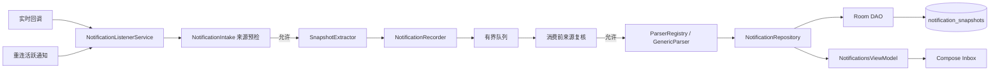

# 架构与边界

## 当前链路

NI-001 已将来源检查放到提取之前，并在消费侧复核；软件与真机证据分开见 [STATE](STATE.md)。本图是现有采集链，尚不包含消息到候选或 AI。

## AI 接入目标（尚未实现）

[AI 模块](../product/AI/README.md) 作为独立业务功能纳入现有单 `:app`，拟新增 `ai.api` / `ai.local` / `ai.remote` / `ai.validation` 与 `ui.ai`，职责与允许方向见 [技术接入](../product/AI/IMPLEMENTATION.md)。消息投影、作业和候选仍复用共享 Repository；应用处理服务选择引擎并校验，系统监听器和 UI 不直接执行推理。

本地 / 云端共用提取契约和校验，不共享隐式故障切换；配置版本与来源准入在发送和候选提交处分别检查。实施时才为实际新增包登记检查器规则并运行自测，本轮未新增 Gradle 模块、网络依赖或包白名单。

## 职责归属

| 包 / 入口 | 负责 | 不应负责 |
| --- | --- | --- |
| notification 根包 | 系统适配、复制受控数据、调度处理与状态观测 | 页面状态、AI、BLE、重复实现持久化规则 |
| notification.model | 普通数据契约 | Android Notification / Bundle、Room、UI |
| notification.parser | 解析策略、版本、0..n 消息、可用性 | 数据库访问、UI、设备传输 |
| data.repository | 快照幂等、版本、持久化用例、清理 | UI、系统回调对象 |
| data.db | Entity、DAO、迁移与 schema | UI、Service、解析器执行 |
| data.settings | 来源与保留期、监听状态存储 | UI / 解析 / 硬件业务 |
| ui | 状态收集、展示、用户事件交给用例 | 直接写 DAO、解析原始通知、GATT |
| device | 后续设备传输端口与适配器 | 通知解析、任务业务、UI |
| di 与应用入口 | 装配依赖、生命周期接线 | 成为第二份业务规则实现 |

## 自动规则

[rules.json](checks/rules.json) 是轻量检查器的依赖规则来源，按文件包名选择最具体规则；未知包、新 Java 文件或未知生产源集会失败，要求先登记边界。

- model 只引用 model；禁止 Android、AndroidX、UI 等包引用。
- parser 允许 model / parser；当前 Registry 可用 Android 日志，其他外部依赖仍需审查。
- repository 可引用 db / settings / model 及 ParseResult，不可反向引用 Recorder 或 UI。
- data.db 只引用自身；settings 只引用自身与 `ApplicationScope` 注解。
- notification 根包可引用解析、模型、Repository、Settings、`ApplicationScope`。
- ui 可引用 ui / repository / settings；不新增 DAO / Entity 直连。
- di / 应用根入口用于装配；放宽内部引用，但不放宽业务职责审查。

当前单模块存在包依赖回路（notification 调用 repository，而 repository 使用位于 parser 包的 ParseResult）。本版只限制非法引用，**不声称已经构成无环 Gradle 模块图**。第二个独立用例需要共享契约时，再考虑把 ParseResult 移到 model；不为目录整齐先拆多个模块。

## 历史例外

| 精确文件 → 符号 | 原因 | 退出条件 |
| --- | --- | --- |
| NotificationsViewModel → NotificationSnapshotEntity | 当前流直接暴露 Entity | NI-006 引入读取 / 展示模型后删除 |
| NotificationsScreen → NotificationSnapshotEntity | 卡片直接使用 Entity | NI-006 同步删除 |
| StatusViewModel → NotificationSnapshotDao | 当前计数直接查 DAO | NI-005 改为 Repository 查询后删除 |

例外仅匹配单个文件与符号，不能扩展成整个 `data.db.*`；失效例外也导致检查失败，提醒清理。修改边界与扩大例外需要在任务记录里解释，但日常修复无需额外审批步骤。

## 检查边界

检查器扫描 Kotlin 中显式的项目包引用（含 import 和全限定名），去除普通注释及字符串后匹配；也检查 model 的 Android 引用。它不是 Kotlin 编译器，不能证明运行时调用关系、反射、同包隐式调用、所有第三方依赖或业务正确性。Gradle 配置审查、编译和行为测试仍然必需。新源集与新模块不能通过默认跳过变成绿色。
