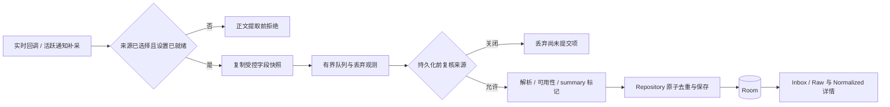

# TodoInk MVP Phase 1 实施方案（已批准）

- 版本：v0.1；日期：2026-09-20。
- 方案状态：APPROVED，2026-09-20 用户批准 Phase 1 v0.1，见第 9 节审核记录。
- 用户已选择本次范围：先完成通知采集（Phase 1）。范围选择只用于编写方案，不表示开始开发。
- 执行入口：[根 AGENTS.md](../../AGENTS.md)。审核通过后，按本方案和各任务契约实施。
- 依据：[PRD](../reference/TodoInk_PRD_Technical_Design.md) §5–24、§40–44；[当前代码事实](PROJECT.md)；[业务契约](CONTRACTS.md)。

## 1. 这次要交付什么

交付一个可安装的 Android 调试版本，让用户完成：

**选择通知来源 → 授予通知访问权 → 收到通知 → 在 Inbox 中看到记录 → 查看原始受控字段与解析结果 → 关闭重开仍可查看。**

用户关闭某个来源后，后续通知不再进入采集链。重复通知不会无限新增相同内容；采集失败、丢弃或内容不可见时，有可解释的状态。

本阶段要回答的是：在实际测试手机上，微信、企业微信、QQ 的系统通知能提供什么，哪些信息可靠、哪些受系统或来源 App 限制。验收只对记录过的设备、系统、来源版本和场景负责，不承诺读取聊天历史或在所有 Android 机型上表现相同。

### 明确范围

| 首版必须交付 | 本轮不实施 |
| --- | --- |
| 通知访问授权与连接状态分别显示 | 候选 TODO、规则识别、任务状态机 |
| 来源选择，默认不选择任何 App | 云端 AI、账号、服务器、云同步 |
| 实时采集与重连后的活跃通知补采 | BLE、ESP32、墨水屏、硬件采购 |
| 受控字段快照、正文解析、summary 区分 | 聊天数据库读取、Hook、历史聊天导入 |
| Room 持久化、内容版本与观察次数、迁移 | 自动回复、自动向联系人发送测试消息 |
| Inbox、Raw / Normalized 详情、状态诊断 | 每日汇总、自动提醒、复杂后台调度 |
| 保留期设置、过期清理、日志与备份保护 | 应用商店发布、正式签名、多设备同步 |
| 自动化回归与三款 App 真机记录 | 通知样本批量导出、全量 extras 转储 |

保持现有 Kotlin / Compose / Room / Hilt 和单 `:app` 模块。没有重建工程、替换技术栈或引入通用 AgentLoop 的工作。

## 2. 从现有代码继续，而不是从零开始

2026-09-20 重新比较了原基线中的 49 个源码 / 配置文件，哈希未变；仍只有 `src/main`，未见测试源集，当前目录仍不是 Git 仓库。没有据此宣称 App 已构建或 Phase 1 已通过。

| 能力 | 当前基础 | 本次工作 | 任务 |
| --- | --- | --- | --- |
| 通知监听 | 已有 Service 与重连补采 | 共享入口、提取前过滤、来源撤销竞态 | NI-001 |
| 授权 / 状态 | 已有状态页 | 独立授权判断、连接与恢复状态、错误可见 | NI-005 |
| 字段 / 解析 | 已有 Draft、Parser 与 Registry | 正文降级、分组判断、消息结构保存、字段可信度 | NI-003 |
| 快照保存 | 已有 Room v1 与内容版本 | 去重语义、事务、并发、旧数据兼容 | NI-002 |
| 异步采集 | 已有容量 128 的队列 | 丢弃计数、取消传播、异常后继续处理 | NI-004 |
| 用户查看 | 已有通知列表和来源设置 | 详情、读取模型、保留期与清理 | NI-006 |
| 工程验证 | 已有 harness 静态门禁 | 可运行测试底座、实际构建与设备证据 | NI-000、NI-007 |

对应缺口 G01–G11 保留在 PROJECT；不把 README 中的“已落实”直接当验收结果。

## 3. 用户页面与默认行为

沿用“通知 / 状态 / 设置”三个页签，通知卡片进入详情页，不为页面命名重新组织工程。

| 页面 | 首版可见行为 | 关键空态 / 异常态 |
| --- | --- | --- |
| 通知 Inbox | 显示来源名称 / 包名、标题、可用正文、接收时间、内容版本、观察次数 | 加载中、没有记录、内容隐藏 / 不可用、读取失败分别表达 |
| 通知详情 | Raw 展示受控字段；Normalized 展示解析出的 0..n 消息、可确定的发送人 / 会话、可用性与解析版本 | 字段未提供就明确显示未知；summary 单独标记，不猜正文与发送人 |
| 状态 | 授权状态、监听连接、最近回调 / 保存、最近错误、队列丢弃、记录数；跳转系统授权页 | “已授权但未连接”不能显示为正常采集；重连不声称补齐历史 |
| 设置 | 已安装来源选择、默认全部关闭；保留期建议提供 1 / 3 / 7 / 30 天，默认 3 天 | 应用列表加载 / 空 / 失败分开；来源关闭成功才展示已关闭 |

手机 App 自身不请求网络能力。微信等来源 App 是否联网属于其自身行为。

保留期的拟定最小实现：启动时、修改保留期后触发清理，持续采集期间以可控频率触发清理；列表不继续展示已过期项。进程未运行时不承诺准点物理删除，界面说明在下一次清理时删除。本轮不新增精确后台删除或 WorkManager 依赖；如要求严格的后台删除时限，需调整本方案。

## 4. 目标数据链与模型边界



- Phase 1 仍以通知快照为保存单位。可以为消息列表和解析结果增加受控存储字段，不提前建立 Phase 2 的独立 ObservedMessage / Todo 业务。
- MessagingStyle 原始消息结构与解析结果必须能在重开后恢复；保存消息条数不能替代保存正文。
- Parser 优先级固定为 MessagingStyle → textLines → bigText → text；不将多个表示机械拼接。专属解析器只对真实样本证实的差异增加，通用解析已满足需求时不强造三个空实现。
- 内容哈希要包含有效正文结构及已定义的语义字段，不因 postTime / receivedAt 单独变化产生新版本；不同通知 key 不合并。
- 查询最新版本、判断重复、写入或累加计数在持久化边界保证原子性，不能只依赖某个调用者的 Mutex。
- 每次发布过的 schema 变化都需要增量迁移与导出记录。老记录没有保存的 MessagingStyle 正文不能回补，保留可用字段并标为历史信息不足；禁止清空旧库来绕过迁移。

## 5. 里程碑与演示结果

| 里程碑 | 任务 | 可审核的交付 | 完成关口 |
| --- | --- | --- | --- |
| M0：能构建、能验证 | NI-000 | 工程环境记录、真实生产行为回归、测试报告、debug APK | 本次构建与非空测试通过，设备测试环境清楚 |
| M1：可控地开始与停止采集 | NI-001 → NI-005 | 来源关闭不读正文，授权与连接分别显示，设置成功语义一致 | V01、V02、V08；至少一款来源演示 |
| M2：采到的内容不丢语义、不重复灌库 | NI-003 → NI-002 | 正文可持久化、字段可解释、内容版本与事务去重 | V03–V06、V10 中的存储用例、相关 V13 |
| M3：故障可见，历史可检查 | NI-004 → NI-006 | 队列与错误状态、详情页、保留期、兼容与备份证据 | V07、V09–V13；完成三项历史 UI 依赖例外清理 |
| M4：三款真实来源验收 | NI-007 | 可安装 APK、24 格来源场景矩阵、限制清单、阶段结论 | 软件门禁 + 真机证据 + 无未解决阻断问题 |

Vxx 的原始规格见 [验证矩阵](VERIFICATION.md)。任务“实现完成”和“所需验证通过”分别记录；设备缺失不能通过跳过把 M4 填绿。

**批准后的建议串行顺序：NI-000 → NI-001 → NI-005 → NI-003 → NI-002 → NI-004 → NI-006 → NI-007。**

NI-003 先确定可保存的正文结构，NI-002 再实现覆盖该结构的去重，避免哈希设计反复返工。NI-004 可以在 NI-001 后独立研究，但默认按上述顺序实施，减少同时修改 Recorder 的冲突。

依赖首先要求前置实现与支撑下一任务的软件检查可用。若前置任务仅缺独立真机证据，可保持 VERIFYING，继续获批准且不依赖该设备的开发；不得因此标记前置任务 DONE 或跳过阶段出口验收。工具链无法构建、契约未定或必需回归失败时，先解决阻塞。

## 6. 八个可执行任务包

本方案已批准。下表为范围摘要，当前实施状态以各任务文件及 STATE 为准；批准不等于任务已完成。

| ID | 工作内容 | 必需依赖 | 风险 / 规模 |
| --- | --- | --- | --- |
| [NI-000](tasks/NI-000-test-foundation.md) | 验证工具链、补测试配置、可控时钟 / 调度、首个调用生产代码的回归 | 方案获批；设备信息可先登记 | 中；环境未知 |
| [NI-001](tasks/NI-001-source-filter.md) | 提取前过滤、实时 / 补采共用入口、消费侧复核来源 | NI-000 | 中；设置与队列竞态 |
| [NI-005](tasks/NI-005-listener-status.md) | 授权 / 连接分离、状态恢复、来源设置状态、Repository 计数 | NI-001 | 中；系统生命周期 |
| [NI-003](tasks/NI-003-notification-content.md) | 受控字段、正文降级、summary 与隐藏标记、完整性存储 / 迁移 | NI-001、NI-000 | 大；按解析与存储两个步骤交付 |
| [NI-002](tasks/NI-002-snapshot-dedup.md) | 稳定哈希、原子去重、并发重放、历史哈希兼容 | NI-003 | 中；事务与旧数据 |
| [NI-004](tasks/NI-004-pipeline-reliability.md) | 队列溢出可见、错误分类、取消传播、后续消息继续处理 | NI-001、NI-000；最终联测用 NI-002 / NI-003 | 中；异步边界 |
| [NI-006](tasks/NI-006-inbox-retention.md) | Inbox / 详情读取模型、保留期设置与清理、迁移 / 备份验收 | NI-002、NI-003、NI-004、NI-005 | 大；按查看与生命周期两个步骤交付 |
| [NI-007](tasks/NI-007-device-acceptance.md) | 微信 / 企微 / QQ 真实场景、安装重开与回归、出包与限制记录 | 以上全部 | 大；真机与来源 App 行为 |

规模表示拆分与风险，不是工期承诺。NI-000 验证环境、NI-003 获得实际来源样本后再估日期；现在不把环境等待或未知 ROM 适配写成确定工时。

## 7. Phase 1 的验收标准

### 软件行为

| 验收项 | 可观察的通过条件 |
| --- | --- |
| 来源边界 | 未选来源提取器调用数为 0，存储数为 0；关闭来源成功后尚未开始提交的排队项不再保存 |
| 快照去重 | 同 key 同内容仅累加观察次数；时间变化不产生内容版本；A→B→A 有三个连续版本；不同 key 同文不合并 |
| 正文完整性 | 四种正文来源分别有回归；只含 MessagingStyle 正文的记录重开后可查看；未知字段不猜测 |
| 正常负载 | 设置允许、存储可用、不取消且不溢出时，投递 100 条不同 key 的合成通知，最终保存 100 条 |
| 溢出负载 | 冻结消费者，按声明容量填满后再投递，丢弃项与计数一致；容量调整时测试按声明容量构造，不写死业务承诺 |
| 故障隔离 | 单条解析 / 保存失败不终止后续处理；取消不伪装成业务错误；不无限重试 |
| 用户查看 | 列表倒序、详情字段可追溯，授权 / 连接 / 保存状态一致，读取失败可见 |
| 数据生命周期 | 已发布旧库升级后不丢可用数据；保留边界正确；普通日志无正文；备份 / 恢复符合本地隐私契约 |

### 真机来源覆盖

微信、企业微信、QQ 各验证 8 类场景，共 24 格：私聊、群聊、连续消息、同通知更新、多会话汇总、来源 App 前台、锁屏隐藏预览、监听重连后的活跃通知补采。

每格记录设备 / ROM / Android 版本、来源版本、设置、系统是否产生通知、实际暴露字段、TodoInk 保存 / 展示结果。确认系统未产生通知或隐藏字段时，标记“来源 / 系统限制已观察”，不能写“正文采集成功”。未安装应用、没有测试账号、没有执行的格子标 NOT_RUN / BLOCKED；不等同于系统限制。

每款来源至少要有一个真实可见正文通知被捕获、保存并重开后查看的成功证据，否则该来源尚未完成验证。三款中缺任何一款，不能宣称三款来源已全部验收。

设备基线建议为一台已确认可用的 Android 测试手机（满足项目 minSdk 29），安装三款目标 App 并具备自用测试会话。JVM / 模拟器覆盖软件规则，首版不承诺全 ROM / 全机型认证。系统备份恢复等破坏性实验仅在专用测试环境进行。

### 发布阻断条件

未选来源读取正文、静默丢通知、重复灌库、已保存正文重开后丢失、权限状态误导、旧库升级丢数据、通知正文进入普通日志、必需验证缺失，均不能作为完成版本交付。系统客观限制与程序缺陷要分别记录。

## 8. 按 AGENTS.md 执行

审核通过后，把用户批准的版本、任务范围、默认策略和设备条件写入本文件审核记录；仅批准部分任务时只推进该部分。已经批准的范围内不逐个函数或文件反复请求确认。

每个任务沿同一循环执行：核对基线 → 验收契约 → 必要失败回归 → 实现 → 检查 → 审查 → 更新任务与 STATE。

```powershell
# 文档 / 结构检查
pwsh -NoProfile -File .\doc\harness\checks\check.ps1

# 功能的软件门禁
pwsh -NoProfile -File .\doc\harness\checks\check.ps1 -Mode Verify

# 有所需测试设备且涉及设备行为时
pwsh -NoProfile -File .\doc\harness\checks\check.ps1 -Mode Device
```

任务记录保留实际命令、退出码、非空用例数、当前报告和设备条件。代码已完成但缺少所需设备证据时，保持 VERIFYING / BLOCKED，并继续处理获批准且不依赖该环境的工作。

当前没有 Git。执行时先记录文件基线，建议建立本地 Git 以便分步回滚；初始化或发布远端不属于本次方案编写。未建立 Git 时仍可按源码哈希与变更文件清单审查。数据库兼容单独处理，恢复代码不代表数据库也能安全降级。

## 9. 审核清单与记录

| 审核项 | 建议方案 / 当前状态 |
| --- | --- |
| 本次终点 | 仅 Phase 1；已按下方批准记录获得实施授权 |
| 默认策略 | 默认不选来源；本地保存；保留 3 天，可选 1 / 3 / 7 / 30 天；不承诺进程未运行时准点删除 |
| 界面 | 沿用通知 / 状态 / 设置；增加 Raw / Normalized 详情，不做正式 TODO 首页 |
| 执行顺序 | 按第 5 节八任务顺序；先修复已有骨架，再真机验收 |
| 兼容与测试 | 保留旧数据；首版验证一台明确设备上的三款目标 App，并记录适用范围 |
| 设备待补 | 手机型号 / Android 与 ROM 版本、三款 App 是否具备测试会话；可以随审核意见提供 |

**实施批准记录：**

- 批准的方案版本 / 任务范围：Phase 1 v0.1 全部（M0–M4，NI-000…NI-007），2026-09-20 用户回复“同意 Phase 1 v0.1”。
- 对默认策略的调整：未提出，按第 9 节建议执行（默认不选来源；本地保存；保留 3 天，可选 1 / 3 / 7 / 30 天；不承诺进程未运行时准点删除）。
- 可用设备与测试条件：用户未提供，标记待补；设备到位前真机验收项保持 NOT_RUN / VERIFYING。
- 原始用户审核意见与日期：2026-09-20，“同意 Phase 1 v0.1”；未附带设备信息与额外修改意见。

任务状态随批准由 DRAFT 转为 READY；NI-000 开始后按 WORKFLOW 推进。

可使用这样的审核回复：`同意 Phase 1 v0.1，按建议默认策略和任务顺序执行；测试手机是……。` 也可指定只批准 M0 / M1 或直接指出要修改的范围。这里的示例不是已经获得的批准。

## 10. 本阶段以后的路线

保持 PRD 阶段编号：Phase 2 是通知到候选任务与用户确认；Phase 3 是 AI 提取；Phase 4 是 BLE + ESP32；Phase 5 是墨水屏显示；Phase 6 是自动汇总与功耗优化。详细进入条件见 [ROADMAP](ROADMAP.md)。本次批准 Phase 1 不会自动启动这些阶段。
