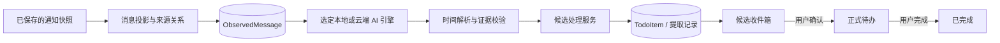

# TodoInk 下一阶段：AI 消息处理与候选待办（待审核）

- 版本：v0.3；日期：2026-09-22；状态：DRAFT，双模式与消息盒子已纳入产品方向，实施范围尚待审核。
- 当前产品范围与交付批次由 [产品 MVP v0.1](MVP_PRODUCT_PLAN.md) 统一；本文继续负责消息 / 候选 / 任务契约，增加 MB-001 / MB-002 消息盒子任务，不替换原 TD / AI ID。
- 目标：沿 [PRD](../reference/TodoInk_PRD_Technical_Design.md) §25–28，完成通知到候选待办、用户确认和任务管理的手机端闭环。
- 本轮只拆解任务；不启动功能开发，不将 Phase 1 的批准自动延伸到 Phase 2。
- 工作入口：[AGENTS.md](../../AGENTS.md)；现状与证据：[STATE](STATE.md)、[PROJECT](PROJECT.md)、[NI-000 验证记录](evidence/NI-000-verification.md)。
- 页面配套：[App 前端设计方案](../design/TodoInk_前端设计方案.md) 与可点击预览，均为待审核设计；UI 批次映射原 NI / TD 任务，不额外扩大实施范围。本文的初次进度快照以 STATE 的后续记录为准。
- 2026-09-21 用户要求将本地模型与可配置 API 整合为独立的 [AI 模块](../product/AI/README.md)。本版把 AI 提取纳入 Phase 2，规则负责确定性预处理 / 校验和效果对照；保留消息、候选、去重与生命周期契约。新增页面与任务见 AI 模块，不将方案交付视为功能完成。

## 1. 下一阶段交付

**系统通知 → 可追溯消息 → 本地或云端 AI 提取 → 证据与时间校验 → 候选收件箱 → 用户编辑 / 确认 / 忽略 → 正式待办 → 完成。**

例如收到“明天下午三点前把报价单发给我”，形成待审核候选。用户修正标题或截止时间后确认，才进入正式待办。收到“我明天把报价单发给你”，不能仅因出现“明天”和“报价单”就给用户创建任务。

| 本阶段包含 | 留在后续阶段 |
| --- | --- |
| ObservedMessage 消息层、来源关系与重放去重 | TodoInk 自建云服务器、账号与同步 |
| App 抽屉、TodoInk 本地查看计数、点击跳转原 App | TodoInk 内直接回复（用户已否决）、完整双向聊天采集 |
| 本地模型与自定义云端 API、任务对象判断、结构化提取结果 | AI 聊天、完整聊天历史补全、跨服务自动路由 |
| 明确范围的时间解析、模糊时间保留待确认 | 自动提醒、周期任务、日历同步 |
| 候选收件箱、编辑、确认、忽略 | BLE、ESP32、墨水屏 |
| 已确认 / 已完成列表、标记完成 | 每日汇总、任务协作、自动执行任务 |
| 幂等处理、进程恢复、数据保留与溯源 | 通用插件平台、跨进程 AgentLoop |

继续使用 Kotlin、Compose、Room、Hilt 和单 `:app` 模块，不重建 Phase 1 的监听器、设置和测试底座。

## 2. 当前进度与进入条件

用户反馈 MVP 已初步建立。2026-09-21 重新核对到通知采集与四入口 UI，待办 / 待确认仍为空态，尚无 AI 引擎。**Phase 1 仍有未完成项，不能把页面齐全当成处理闭环已实现。**

| 项目 | 当前可核对事实 | 对 Phase 2 的影响 |
| --- | --- | --- |
| 测试底座 | NI-000 已有真机存储用例通过证据；后续 NI / UI 软件检查记录见 STATE | 复用底座；本轮文档调整没有重跑 Android 测试 |
| 来源保护 | NI-001 已通过 Intake 在提取前过滤，Recorder 消费侧复核；真机来源开关待验 | 复用入口；AI 另加处理 / 云端来源准入，不替代采集白名单 |
| 正文持久化 | GenericParser 降级正文未输出为消息；Room v1 仍只保存 parsedMessageCount | NI-003 是消息投影和来源追溯的直接前置 |
| 去重与事务 | Repository 哈希仍含 postTime，查最新 / 写入未组成事务 | NI-002 是稳定投影与自动候选生成的前置 |
| 状态 / 可靠性 / 查看 | UI-B 已实现详情和部分 NI-005；NI-004 等仍有缺口，完整记录见 STATE | 保留原任务，不复制为新的“Phase 2 修复任务” |
| 真机验收 | NI-000 真机记录存在；NI-007 三来源矩阵未完成，AI 真机性能未测 | 分开记录采集验收与本地模型资源验收，不能互相替代 |

分两个关口推进：

1. **开发准备关口**：Phase 2 范围获批后，可先设计数据契约、标注样本、校验 / 时间解析与 AI 引擎的合成输入测试。此时不宣称真实通知已经接通。
2. **真实链路关口**：NI-001 / NI-002 / NI-003 的接口与行为可用，相关迁移和存储测试通过，才能接入自动处理。Phase 2 最终验收还必须包含 Phase 1 其余相关任务与 NI-007 的证据。

如实现或真机证据存在于其他目录，先核对并同步基线，不重复重写。缺设备时可继续不依赖设备的获批工作，不把缺证据改成通过。

## 3. 用户流程与建议默认值

| 用户动作 | 预期结果 |
| --- | --- |
| 在 AI 模块配置本地或云端并开启自动处理 | 仅处理开启后、仍在允许来源内的新消息；云端还需允许发送来源，默认不回填历史 |
| 打开候选收件箱 | 看到标题建议、截止时间或模糊时间提示、来源与最小证据、本地 / 云端引擎标记 |
| 编辑并确认 | 保存用户选择的标题 / 时间，进入 CONFIRMED；原通知不会被修改 |
| 忽略候选 | 进入 IGNORED，同一消息重放不再次弹出相同候选 |
| 查看待办列表 | 展示已确认未完成任务；可按确定日期排序，无日期单独置后 |
| 标记完成 | CONFIRMED → COMPLETED，可在已完成列表查看；重开 App 后状态保留 |
| 关闭识别 / 某来源 | 尚未开始提交的相关提取结果不再写入；已确认任务保留 |

建议首版只支持 PRD 的四种任务状态：CANDIDATE、CONFIRMED、COMPLETED、IGNORED。撤销完成、恢复忽略、手工新建任务和批量操作后置，避免先扩大状态流。

AI 无法判断行动时保留“不确定 / 需人工判断”的提取记录；行动明确但时间模糊可生成待确认候选。模型自报分数不表述为统计正确率，也不自动授权正式入库。

## 4. 三层数据与职责

| 数据 / 服务 | 拟定职责与关键字段 |
| --- | --- |
| NotificationSnapshot | 沿用 Phase 1 的受控原始字段、内容版本、解析信息；不直接当任务 ID |
| ObservedMessage | messageId、来源 App / 可确认的会话与发送人、正文、消息原始时间、首次观察时间、时间依据 / 时区、身份强度 |
| 消息与快照关系 | 记录 snapshotId、段落位置、解析版本等；同一消息可被多个快照观察到，不丢溯源关系 |
| 提取记录 | 消息 / 配置 / 模型 / 提示模板 / 时间解析版本、结果 ACTIONABLE / NOT_ACTIONABLE / UNSURE、原因、证据范围、作业状态；失败不伪装非任务 |
| TodoItem | 标题、可选说明、结构化截止信息、四态、来源消息关系、用户编辑版本、创建 / 更新时间 |
| 处理服务 | 串联消息、选定引擎、校验与幂等写入；负责取消、来源 / 配置变化和进程恢复，不运行在系统回调线程 |

这是设计清单，不是已实现的 Kotlin API。实施时 Kotlin 模型 / Entity / 导出 schema 才是字段事实来源，复用 AppClock；需要时区上下文时增加可测试的最小接口。

纯校验和时间模块不访问 Android UI / Room。UI 经应用服务或 Repository 读写，引擎不直接落库；AI 包依赖见 [技术接入](../product/AI/IMPLEMENTATION.md)。新增包与依赖在对应实现任务里登记 `rules.json`，本轮不预先放宽边界。

## 5. 关键业务契约

### 消息身份与任务幂等

- 同一快照重复投影不产生新消息；同一消息、同一有效提取版本重放不产生新候选。
- 优先利用真实稳定消息标识；有可信消息时间、发送人和作用域时，可在同一来源范围内识别重叠消息列表。
- 只有文字相同不足以证明同一消息。未知会话 / 消息时间时保留身份不确定性，不跨 App、会话或通知盲目合并。
- 同一通知列表从 A 变为 A+B，在身份可确认时只为 B 新建候选；同一人不同时间重复同一句请求可能是新任务，不能按标题全局去重。
- 用户确认、完成或忽略后，重放与规则 / 模型 / 提示模板升级都不能把任务恢复成 CANDIDATE，也不能覆盖用户修改。提取版本变化本身不能作为复制任务的理由。

### 提取与时间

- 先判断“是否要求用户做某件事”，再提取动作、对象和证据；时间关键词本身不足以判断待办。
- “我明天发给你”等对方承诺、否定请求、广告 / 验证码、summary / 隐藏无正文、执行对象不明的群消息要覆盖负例或不确定结果。
- 一个消息可以产生 0..n 个候选，但首版只拆分边界明确的独立行动，不强行拆解复杂句子；每个结果对应原文证据。
- 时间以可信消息时间或首次观察时间为锚，记录实际采用的时区和来源；重放时保持原锚，不能把“明天”按重放当天重新解释。
- 建议首版支持今天 / 明天 / 后天、明确日期与明确时刻；周几采用书面定义并验证跨周边界。无年份、节假日、业务日等模糊表达保留待确认。
- 仅日期保留日期精度；“下午”“下班前”“有空时”不擅自补为某个时刻。日期与精确时刻不能都挤进一个看似精确的 dueAt。
- 过去时间与无法还原历史时区的结果给出提示，不自动挪到下一天或下一周。

### 保留期与来源清理

- 原始通知、消息正文和未确认候选跟随来源数据保留期，不通过复制完整正文绕开 Phase 1 的清理。
- 用户已确认 / 完成任务保存其标题、用户编辑内容和必要来源摘要，可长期本地保存；完整原文通过尚未过期的来源关联读取。
- 原始通知清理后，已确认任务继续存在，来源入口明确显示“原通知已清理”；数据库级联不能误删正式待办。
- 忽略抑制记录只保留幂等所需信息，保留期限与可重放来源一致，不无限保存私人正文。
- 确认与清理并发时由事务确定结果：先确认则任务保留；先清理则界面提示候选已过期，不写入半成品。

## 6. 里程碑与 TD / AI 任务

| 里程碑 | 任务 | 可审核交付 |
| --- | --- | --- |
| P2-M0：输入可用、评测有依据 | TD-000 | 前置缺口清单、脱敏样本、支持语法与验收标注 |
| P2-M1：消息和任务可保存 | TD-001 → TD-002 → MB-001 / MB-002 | 数据契约 / 迁移、消息投影、App 抽屉与跳转；不把原 App 未读 / 回复状态混成本地状态 |
| P2-M2：双模式可提取与校验 | TD-003、TD-004、AI-001–AI-003 | 共用契约、时间与证据校验、本地与云端真实引擎 |
| P2-M3：用户可实际管理 | TD-005 → TD-006 → TD-007、AI-004 | 可靠处理、AI 页面、候选编辑确认、正式待办与生命周期 |
| P2-M4：真实来源闭环验收 | TD-008、AI-005、MB 验收 | 双模式评测、消息盒子 / 跳转真机证据、升级回归、APK 与试用报告 |

| ID | 任务 | 依赖 | 规模 / 主要风险 |
| --- | --- | --- | --- |
| [TD-000](tasks/TD-000-input-readiness.md) | 核对 Phase 1 输入与准备标注样本 | 无；真实样本受 NI-007 环境影响 | 中；证据和来源差异 |
| [TD-001](tasks/TD-001-todo-contracts.md) | 三层模型、状态服务与数据库迁移 | TD-000 的输入契约；迁移基于最终 Phase 1 schema | 大；状态 / 数据兼容 |
| [TD-002](tasks/TD-002-message-projection.md) | 消息投影、身份、溯源与消息去重 | TD-001、NI-003 / NI-002 的已验接口 | 大；错误合并和重复候选 |
| [TD-003](tasks/TD-003-rule-extractor.md) | 共用提取契约、校验与规则对照 | TD-000 样本、TD-001 契约 | 中；执行对象与误报 |
| [TD-004](tasks/TD-004-due-time.md) | 截止时间解析与不确定性 | TD-000 样本、TD-001 时间契约 | 中；锚点 / 时区 / 精度 |
| [TD-005](tasks/TD-005-candidate-processing.md) | 自动处理、幂等、取消与恢复 | TD-002–TD-004、AI-001；集成需 AI-002 或 AI-003；相关 NI | 大；重放、事务与状态变化 |
| [TD-006](tasks/TD-006-candidate-inbox.md) | 候选收件箱与编辑确认 / 忽略 | TD-001、TD-005 | 中；并发点击与旧结果覆盖 |
| [TD-007](tasks/TD-007-todo-lifecycle.md) | 待办列表、完成操作与数据生命周期 | TD-001、TD-006；NI-006 清理入口 | 中；误删任务与正文长期保留 |
| [TD-008](tasks/TD-008-phase2-acceptance.md) | 自动化 / 真机验收与出包 | TD-000–TD-007、MB-001 / MB-002、AI-005 证据；相关 NI 验收 | 大；评测与真实场景差距 |
| [MB-001](tasks/MB-001-app-drawers.md) | App 抽屉、稳定消息列表与本地查看状态 | TD-001 / TD-002、NI-006 相关接口 | 中；计数、版本与资料隔离 |
| [MB-002](tasks/MB-002-open-source.md) | 点击入口管理、目标绑定、跳转与失效降级 | TD-002、MB-001、NI-001 相关边界 | 中；历史入口、会话误投 |

新增五项 [AI-001–AI-005](../product/AI/IMPLEMENTATION.md) 分别负责配置与隐私准入、云端适配、本地运行时、AI 页面、双模式联合验收。依赖顺序以该清单为准，复用现有 TD 工作；不能只完成一种模式就把双模式标为 DONE。

交付批次使用产品 MVP 的 MVP-M0–M4，允许单个真实引擎先跑手机闭环，本地兼容评估可提前；本表 P2-Mx 保留为已有任务归属，不与产品里程碑的同号视为一一对应。最终必须含 MB-V01–V08、P2-V01–V12 和 AI-V01–V10 的相关证据。

纯算法与合成样本工作可先准备，实际存储集成必须等待 Phase 1 输入就绪。规模是风险提示，不是工期承诺；收到真实样本与设备条件后再估日历时间。

## 7. 关键验收场景

新场景使用 P2-Vxx，与 Phase 1 的 Vxx 分开。以下全部是目标，当前未执行。

| ID | 输入 / 操作 | 必须观察到的结果 |
| --- | --- | --- |
| P2-V01 | “请明天下午三点前发报价单给我” | ACTIONABLE，候选有行动与时间证据；用户确认前不进正式待办 |
| P2-V02 | “我明天下午发报价单给你”、否定请求、广告 / 验证码 | 不误认成用户行动；不确定的归为 UNSURE |
| P2-V03 | 群里没有可靠执行对象，或只有 summary / 隐藏正文 | 不猜用户是执行人，不补造行动项 |
| P2-V04 | 单条含两条边界明确的请求 | 两个候选分别有来源证据，重放不增加数量 |
| P2-V05 | 同快照重放、A→A+B 的可信消息列表、不同会话同文 | 不重复建候选、不跨会话误合并 |
| P2-V06 | 锚点固定为 2026-09-20 10:00 +08:00，解析“明天15点前”后隔天重放 | 两次都指向 2026-09-21 15:00 +08:00，不随运行时间漂移 |
| P2-V07 | 只有“明天”、只有“下午”、跨日 / 周 / 年或缺时区 | 精度与歧义真实表达，不制造精确时间 |
| P2-V08 | 连续点击确认、确认与忽略竞争、AI 结果晚于用户编辑 | 只产生一个合法状态结果，用户修改不被覆盖 |
| P2-V09 | 忽略 / 完成后重放、模型 / 提示模板 / 规则版本更新 | 不复活候选，不复制正式任务 |
| P2-V10 | 处理中取消、进程中断重开、引擎异常、关闭处理 / 来源 | 可恢复且幂等；失败不拖垮采集；关闭后未开始提交的结果不写入 |
| P2-V11 | 原始通知过期，确认与清理并发 | 未确认内容按保留期清理，正式任务保留，来源过期可解释 |
| P2-V12 | 已发布旧库升级、重开查看 / 完成、三款真实来源 | 原快照不丢、任务状态保留、真实链路与声明一致 |

TD-000 准备开发样本和独立验收样本，标签包括行动 / 非行动 / 不确定、证据、期望时间精度。原 60 条可用于早期冒烟；双模式对照建议使用 AI 模块定义的独立 200 条（80 / 80 / 40），含合成与脱敏真实样本，来源标记清楚；规模与门槛在 TD-000 冻结。

验收要求核心 P2-V01–V12 回归通过；报告候选准确率、支持语法内召回率、不确定比例、时间准确率的分子 / 分母与错误案例。产品 MVP 第 8 节给出质量 / 性能和试用的建议门槛，在 TD-000 冻结，不临近验收再改标签或缩小分母；小样本不宣传全场景识别率。

## 8. 执行与审核

全部 TD / MB / AI 实施任务当前为 DRAFT。双模式与消息盒子已纳入产品范围；执行时按 AGENTS → STATE → 产品 MVP → 本方案 / AI 模块 → 任务契约读取。Phase 1 已获批准的范围保持有效，不要求重新批准已经授权的修复。

功能任务运行 Static / Verify，数据库 / 生命周期 / UI 场景补 Device 与实际操作记录。现有底座检查器的缺陷不通过放宽业务验收来规避。没有运行的项目明确写 NOT_RUN / BLOCKED。

建议审核四件事：

1. 双模式最终交付都须通过；可先云端合成验证、再本地真机与全链路，硬件仍后置。
2. 是否接受首版仅四态，手工新建、撤销完成、批量操作后置。
3. 是否接受默认关闭 AI 自动处理、来源不预选、开启后只处理新消息；历史回填以后单独提供。
4. 是否接受未确认候选随来源过期清理、已确认任务保留、模糊时间必须由用户确认。

**Phase 2 实施批准：尚未收到。** 获批时记录版本、任务范围、默认策略调整与设备 / 样本条件。任务拆解完成不等于阶段完成，也不自动开始编写应用代码。
