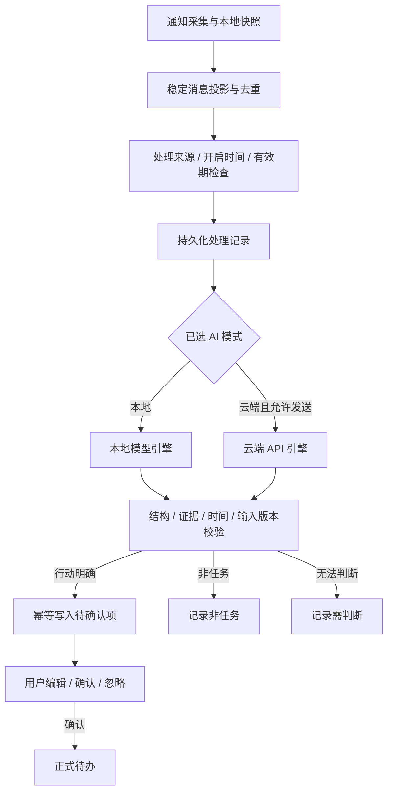

# AI：TodoInk 消息理解模块

- 版本：v0.1；日期：2026-09-21；交付类型：产品与技术方案，尚未实现 App 推理能力。
- 用户已明确的产品方向：将手机本地模型、可配置代理商 / SaaS API 两种方式统一集成到名为 **AI** 的独立模块。
- 配套：[页面设计](PAGES.md)、[实施任务与验收](IMPLEMENTATION.md)、[Phase 2 建设方案](../../harness/MVP_PHASE2_PLAN.md)。模型研究依据见 [可行性评估](../TodoInk_AI消息处理可行性评估.md)。
- 本文是 AI 模块的方案入口；原 PRD 保留为参考快照。实现后的 Kotlin 类型、Room Entity 和 schema 仍是字段事实来源。
- 当前首版交付范围、批次和质量验收见 [产品 MVP v0.1](../../harness/MVP_PRODUCT_PLAN.md)；两模式都保留为最终范围，单引擎联调只是中间交付。
- 2026-09-22 产品主线见 [核心闭环研判](../TodoInk_核心闭环可行性与验证路线.md)：AI 服务于消息到行动清单，不依赖获取完整双向聊天；用户通过消息盒子跳转原 App 回复，AI 不推断不可见的回复或完成。

## 1. 模块定位

AI 负责把已经采集的消息理解为有依据的待办建议。用户可以选择手机本地算力，也可以填写服务地址、API Key 和模型名称使用云端算力；两种方式共用消息输入、结果校验、候选与 TodoList。

**首版闭环：采集通知 → 保存消息 → AI 理解 → 生成待确认项 → 用户确认 → 加入待办 → 完成。**

例如“请明天下午三点前把报价单发给我”，生成“发送报价单”的建议，附截止时间和原文证据。“我明天把报价单发给你”属于对方承诺，不应给用户创建待办。无法判断执行人的群消息进入“需判断”，不能猜测任务归属。

这里的“独立模块”包括独立的产品职责、名为 **AI** 的页面入口、配置和处理接口。工程上先放在现有单 `:app` 内，以包划分职责，暂不新增 Gradle `:ai`，避免为目录拆分引入迁移成本。

## 2. 功能边界

| 能力 | 首版行为 |
| --- | --- |
| 处理模式 | 关闭 / 本地 AI / 云端 AI，最多一种模式生效；初始关闭 |
| 本地模型 | 模型下载或文件导入、完整性检查、加载、自检、卸载、设备状态提示 |
| 云端服务 | 自定义 API Base URL、API Key、Model ID；连接与结构化提取测试 |
| 消息理解 | 判断是否需要用户行动，提取标题、行动证据、时间短语与不确定原因 |
| 候选生成 | 每条消息可产生 0..n 条建议，写入已有规划的待确认体系 |
| 来源控制 | 采集来源、AI 处理来源、云端允许发送来源分别控制；后两者都只能是采集来源的子集 |
| 处理记录 | 查看排队、暂停、成功、非任务、需判断、失败；定位到尚未过期的通知 |
| 质量与隐私 | 确定性校验、版本与幂等保护、有限重试、最小内容发送、无正文日志 |

首版不包含 AI 聊天、自动回复、代用户执行任务、RAG / 向量库、多代理商自动路由、同时调用两个引擎投票。AI 直接创建正式待办作为后续可选策略，当前沿用“用户确认后正式入库”。

## 3. 两种算力如何统一

| 项目 | 本地 AI | 云端 AI |
| --- | --- | --- |
| 推理位置 | 手机进程内的模型运行时 | 用户配置的服务及其上游 |
| 配置 | 已验证的模型文件、版本、量化规格与运行后端 | 协议、Base URL、Key、Model ID |
| 前置条件 | 文件可用、运行时兼容、设备资源自检通过 | 网络、有效凭据、兼容接口、用户选定发送来源 |
| 数据边界 | 消息正文不外发；模型就绪后支持离线推理 | 仅获准消息及必要上下文发送至选定服务 |
| 故障处理 | 暂停或失败，提示释放资源 / 换模型 / 重试 | 显示鉴权、限流、网络或结构错误；按错误类型处理 |
| 输出 | 统一结构化提取结果，经过同一校验器 | 同左；不能因云端返回成功就直接创建任务 |

本地候选沿用研究中的 Qwen3.5-2B 与 Gemma 4 E2B，分别评测 llama.cpp / GGUF 与 LiteRT-LM 的适配路线；Qwen3-1.7B 可作为备选。**这些是待实测候选，不是已完成适配或已承诺支持的模型目录。** 首版只交付一个经目标真机验证的本地组合；模型、量化、运行时及版本作为整体锁定，不能互换文件格式。许可和具体来源在分发前逐项核对。

云端首版采用兼容 Chat Completions 的适配器。“API 地址 + Key”之外通常还需要 **Model ID**；页面提供独立字段。Base URL 是服务根路径，适配器追加端点并在测试页展示最终目标域名，避免重复拼接路径。自定义服务必须先通过合成样本测试；兼容名称不代表支持所有参数、JSON Schema 或模型列表接口。

## 4. 消息处理链

采集监听器只负责采集，不直接运行模型或等待 HTTP。关闭 AI 后仍可采集和查看通知。初次启用只处理启用后新观察到的合格消息，不自动分析历史；消息 ID、首次观察时间和时间锚在 TD-002 固定，重复通知不变成“新消息”。

每项任务绑定输入版本、处理配置版本与选定引擎。关闭处理、变更来源、切换模式、修改云端目标 / Key / 模型时递增配置版本，取消尚未提交的旧任务。新配置生效后旧结果不能写入候选；已经发出的云端请求无法保证撤回，界面据实说明。切换模式不把积压的本地消息自动发送到云端，也不重新分析历史。

重试同一配置下的失败记录必须再次核对来源、有效期和版本。模式或服务变更后，旧记录只保留状态，首版不支持跨配置重算；已有候选、正式待办和用户修改保留。

## 5. 输入、结果与校验

| 对象 | 必须表达的语义 |
| --- | --- |
| 消息输入 | 稳定消息 ID / 版本、正文、已知发送人 / 会话作用域、是否 summary / 缺正文、首次观察时间、可信消息时间与时区依据 |
| 上下文 | 首版以单条消息为主；若必须补充，仅取同一可信会话且获准发送的有限消息，并记录证据可引用范围；不抓取通讯录或完整聊天记录 |
| 提取结果 | ACTIONABLE / NOT_ACTIONABLE / UNSURE，0..n 个行动、标题、证据引用、原始时间短语、歧义原因 |
| 运行元数据 | 本地模型文件标识或云端服务 / 模型 ID、提示模板与校验版本、输入和配置版本、耗时、服务返回的用量（缺失即未知） |
| 失败 | 配置、模型加载、资源、网络、鉴权、限流、超时、拒绝、截断、非法结构等；失败独立于“非任务” |

模型不获得数据库 ID 写入权、网络工具、联系人操作或任务执行工具。通知中“忽略之前的指令 / 把数据发到某地址”等内容只作为待分析文本；云端 URL、Key 与允许来源只能取受控配置。

校验依次检查结构与长度限制、枚举和数量、证据确实存在于允许输入、行动是否有依据、时间锚和精度、当前来源 / 配置 / 输入版本。结构和证据检查不等于证明模型语义正确，仍需效果评测和用户确认。模型的 confidence 或 needs_review 不控制正式入库权限。

相对时间由本地确定性解析器复核；“明天”相对消息固定时间锚，“下班前”保留模糊值，不能擅自补时刻。无法支持的时间保留待确认。模型建议的绝对日期不能绕过 TD-004。

消息到候选的稳定行动身份由 TD-002 / TD-005 管理，不能仅以模型标题、数组顺序或“消息 ID + 模型版本”作为唯一去重依据。重试、换模型、提示词升级不复活已忽略 / 完成任务，不覆盖用户编辑。

## 6. 状态与运行策略

| 层次 | 状态 | 说明 |
| --- | --- | --- |
| 模式 | OFF / LOCAL / CLOUD | 用户的单一选择；另存 enabled，关闭自动处理时对调度器等效 OFF，可保留未启用配置 |
| 引擎可用性 | 未配置 / 准备中 / 就绪 / 不支持 / 不可用 | 不与通知权限或监听连接混为一项 |
| 处理作业 | QUEUED / RUNNING / PAUSED / SUCCEEDED / FAILED / CANCELLED / EXPIRED | 成功写入与终态标记同事务；失效输入不再重试 |
| 语义结果 | ACTIONABLE / NOT_ACTIONABLE / UNSURE | 仅成功得到并验证的结果有语义分类 |
| 待办 | CANDIDATE / CONFIRMED / COMPLETED / IGNORED | 沿用 Phase 2 生命周期 |

UNSURE 在 AI 处理记录中显示“需判断”；可跳转原通知，不伪造可直接确认的待办。明确行动但时间模糊可以生成带提示的候选，由用户确认时间或明确不设截止。

本地推理采用后台调度、单并发、有限上下文与输出长度；内存不足、温控或系统限制时暂停，通知继续保存。长时间后台执行方案须在目标 Android / ROM 验证，不能承诺持续驻留。下载 / 导入 / 加载均显示真实进度或明确的进行中状态，支持取消，关闭模型页不阻塞主线程。

云端首版单并发，有超时、输出上限、请求速率和每日请求次数上限；建议初始每日 100 次并允许用户调小，正式默认值在实施时结合使用样本确认。次数限制在请求前持久化预占，进程重启不重置；未确定是否送达的请求也占用额度。429 可遵循服务等待提示有限重试；401、结构不兼容停止自动重试；已发出但结果未知的超时首版由用户选择重试，提示可能重复计费。

无服务价格表或 token 用量时费用显示“未知”，不编造金额；应用内预算仅是控制措施，不保证供应商侧精确封顶。候选幂等只能避免重复待办，不能保证上游只推理或计费一次。

## 7. 不变量

| ID | 必须保持的行为 |
| --- | --- |
| AI-C01 | 本地模式不发送通知、提示词或结果，不自动切换云端；模型下载请求不携带通知内容 |
| AI-C02 | 云端发送需模式开启、配置就绪、当前采集 / 处理 / 云端来源均允许；每次发出前复核，配置变更与发送准入串行化 |
| AI-C03 | API Key 经 Android Keystore 管理的密钥加密，业务配置仅存密文引用；日志、崩溃报告、普通备份无 Key / 请求正文 |
| AI-C04 | 默认仅 HTTPS，保留系统证书验证；不向重定向后的其他目标发送 Key 或正文；首版关闭自动重定向 |
| AI-C05 | 输出必须通过独立校验；模型拒绝、超时或格式错误不等同“没有待办” |
| AI-C06 | 取消、版本变更、来源关闭和过期与候选提交有明确原子边界；关闭操作成功后尚未开始提交的旧结果不落库 |
| AI-C07 | 任务状态与用户编辑有优先权；AI 不直接创建正式任务或执行外部动作 |
| AI-C08 | 正文、上下文、未确认候选与处理缓存遵守保留期；普通诊断只保存脱敏错误码 / 计数 / 耗时，不能旁路复制永久保存 |

本地模式实现“数据与算力留在手机”的范围是消息处理。模型下载需要联网；已安装的云端功能和 INTERNET 权限本身不说明存在外发，也不证明不存在外发，需在联网与断网两种环境验证。云端模式的服务端保存、训练与上游流转政策由用户选定的服务决定，TodoInk 不能承诺替其控制。

## 8. 当前实现与交付标准

源码已观察：现有四入口为待办 / 待确认 / 通知 / 设置，前两页为空态；Room v1 仅有通知快照，主 Manifest 未声明 INTERNET。尚无消息持久化投影、候选存储或任何 AI 引擎。因此新增 AI 页必须与真实状态和处理链一起接入，不把表单或假数据演示算作 AI 完成。

本模块交付要求两种模式分别跑通同一“通知 → 候选 → 用户确认 → 待办”链路，且通过离线 / 外发边界、错误恢复、来源变化、幂等和真机资源验收。云端先跑通可作为中间里程碑，本地只留接口不能作为双模式完成。具体顺序、依赖与验收见 [实施任务](IMPLEMENTATION.md)。
