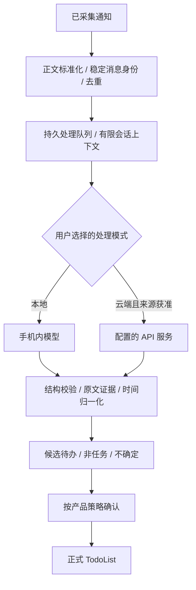

# TodoInk：AI 消息处理可行性评估

- 日期：2026-09-21；版本：v0.1；状态：历史可行性研究。后续用户已要求把两条路线纳入独立的 [AI 模块](AI/README.md)，当前产品、页面和执行顺序以该模块为准，本文保留研究过程与来源。
- 用户目标：采集后的消息通过 AI 理解并生成 TodoList；比较手机本地推理与自定义代理商 / SaaS API 两种路线。
- 依据：[原 PRD](../reference/TodoInk_PRD_Technical_Design.md) §25–30、§40；[Phase 2 草案](../harness/MVP_PHASE2_PLAN.md)；本轮官方资料检索与当前代码静态核对。
- 本轮没有下载模型、发送真实通知、读取 API Key、调用付费推理、安装到手机或实现 Android 功能。

## 1. 判断与建议

**两条路线都可行。推荐共用一条消息处理链，提供可切换的本地 / 云端提取引擎；把中文提取质量和真机资源测试作为本地发布的前置条件。**

本地推理可以让通知内容和推理计算留在手机；但“下载了小模型”并不足以证明准确、稳定或整个 App 没有数据外传。云端更容易接入已有模型服务，手机负担较小，但内容会离开手机，代理商及其上游都进入数据处理范围。

产品建议默认不上传通知。用户主动选择云端模式、配置服务和允许发送的来源后才调用；本地失败不得自动转云端。开发时可以先用合成样本建立云端质量基准，并行安排本地技术验证的工作顺序，不等于把用户的默认模式设成云端，也不要求多个 Agent。

| 维度 | 手机本地 AI | 自定义 API / SaaS AI |
| --- | --- | --- |
| 可行性 | 有官方 Android 运行路径；需验证具体模型、量化、后端与手机组合 | 兼容协议下可用统一 HTTP 客户端，工程路径直接 |
| 通知数据边界 | 推理可完全留在手机；日志、备份、遥测仍需控制 | 请求所含数据离开手机，HTTPS 不改变服务端可处理内容这一事实 |
| 质量 | 小模型是否胜任中文行动对象、模糊时间和否定语义，必须实测 | 可选更大模型作为基准；不能保证任意代理商 / 任意模型更好 |
| 设备 / 网络 | 占磁盘、内存、电量，有冷启动和温控限制；模型就绪后可断网使用 | 依赖网络、鉴权、额度和上游可用性；手机推理负担小 |
| 成本 | 无逐条云端 token 费用；有下载、分发、适配与设备资源成本 | 按供应商计费，需预算、限流、用量与失败重试控制 |
| 更新 | 分发新权重 / 运行时，验证回归 | 切换 model ID 较容易，但上游版本改变也需回归 |
| 建议定位 | 隐私模式和离线能力 | 用户明确选择的质量 / 设备兼容选项 |

这里的工程判断是方案推断，不是 TodoInk 已取得的性能或准确率结果。

## 2. 当前项目距 AI 链路还有什么

2026-09-21 静态核对：已有通知采集、来源过滤、Room 快照和四入口页面。当前 `ParsedMessage` 含发送人、正文、消息时间；Room v1 快照仍只存 `parsedMessageCount`，没有完整消息表。`GenericParser` 的降级正文仍未进入 messages；快照哈希含 postTime；查最新 / 插入未在 Repository 内构成数据库事务。主 Manifest 没有 INTERNET。

因此接 AI 之前，仍需补齐 NI-002 / NI-003 的稳定消息输入和去重，不应把系统每次通知刷新直接变成一次模型请求。界面已有入口不等于候选 / 正式待办业务已接通。NI-005 和 UI 批次正在推进，状态以 [STATE](../harness/STATE.md) 为准。

项目记录有 OnePlus PJZ110 / Android 16 真机测试历史；**本轮 `adb devices -l` 仅发现 x86_64 模拟器**。手机 SoC、物理 RAM、可用 RAM、存储余量和驱动未核实。不能用模拟器速度替代 ARM 真机推理表现。

## 3. 本地模型候选

截至检索日，优先比较以下开放权重模型。选择对话 / 指令调优版本，不把基础预训练模型直接当任务提取器。列表是验证候选，不是“已验证可在当前手机生产运行”的清单。

| 模型 | 官方可核对事实 | 在 TodoInk 中的建议 |
| --- | --- | --- |
| [Qwen3.5-2B](https://huggingface.co/Qwen/Qwen3.5-2B) | 2B 语言模型规模、带视觉编码器；Apache-2.0；有非思考模式，模型卡将小尺寸定位于原型、特定任务微调等研发用途 | **中文提取首轮候选**。只用文本输入，先测 4-bit 量化；不要把通用榜单当作通知准确率 |
| [Qwen3-1.7B](https://huggingface.co/Qwen/Qwen3-1.7B) | 1.7B 文本模型，支持多语言与思考 / 非思考切换，Apache-2.0 | 作为较简单文本架构的对照；Qwen3.5 后端适配不理想时保留此路线 |
| [Gemma 4 E2B](https://ai.google.dev/gemma/docs/core/model_card_4) | 小尺寸针对移动端，支持多语言；Apache-2.0；有指令版本 | **Android 集成对照候选**。配合 LiteRT-LM 文本移动包，比较中文提取而非仅比较运行速度 |
| [Qwen3.5-4B](https://huggingface.co/Qwen/Qwen3.5-4B) | 同系列更大尺寸，Apache-2.0；需支持相应架构的推理后端 | 高内存手机的质量对照；若 2B 达不到要求，再比较额外资源是否值得 |
| [Qwen3.5-0.8B](https://huggingface.co/Qwen/Qwen3.5-0.8B) | 更小尺寸；官方同样强调原型 / 专项研发用途 | 测资源下限或简单分类；不预设能可靠处理复杂群聊和隐含行动对象 |

推荐初始只做 Qwen3.5-2B 与 Gemma 4 E2B 两个完整模型 / 运行时组合；用 Qwen3-1.7B 作为必要时的替补，避免首轮同时维护所有后端。Qwen3.5 支持已进入 [llama.cpp 上游](https://github.com/ggml-org/llama.cpp/actions/runs/21872299037)，但这不等于所有 Android GPU 驱动组合均通过验证。

本项目只处理文本通知，不启用视觉 / 音频编码器、不输入屏幕截图；只有运行时和分发格式允许拆分时才能省下对应模块，不能假设关闭输入就自动减少完整文件体积。

### 内存不能只看参数量

4-bit 权重理论下界约为“参数量 × 0.5 字节”：1.7B 约 0.85 GB，2B 约 1 GB，4B 约 2 GB。**这些是十进制理论计算，不是下载体积、App RAM 或系统最低内存**；实际还有非 4-bit 张量、量化元数据、运行时、KV / 状态缓存、GPU 缓冲和应用自身占用。

Google 官方列出的 Gemma 4 E2B / E4B Mobile Text-only 静态权重加载参考分别为 0.84 GB / 2.2 GB；同页明确不含完整上下文与支持软件的额外占用，且依赖 LiteRT-LM 移动格式。E 指有效参数，不能简单按 E2B 乘 0.5 字节估整包。[官方内存说明](https://ai.google.dev/gemma/docs/core?authuser=0)

首轮设备分组建议（工程假设，非最低规格承诺）：

- 8 GB 手机：测试约 1–2B / E2B 短文本、单并发，先测可用内存再决定启用。
- 12–16 GB 手机：先跑同样的小模型基线；再加入 4B，比较准确率收益、耗电与后台存活。
- 不因为手机有 NPU 就承诺可用；芯片、驱动、算子、量化格式和所选 runtime 都必须匹配。
- 不按模型宣传的 128K / 262K 长上下文配置手机。初始工作集建议上下文上限 2K–4K tokens，输出 256–512 tokens；这些是待评测预算，过长或输出截断必须可观察。

### Android 运行时选择

| 路径 | 适合之处 | 需验证之处 |
| --- | --- | --- |
| [llama.cpp Android](https://github.com/ggml-org/llama.cpp/blob/master/docs/android.md) + GGUF + JNI | 适合 Qwen 文本模型验证；可比较 CPU 与可用 GPU 后端 | NDK / JNI 生命周期、取消、线程、具体量化和 chat template；锁定上游 commit / 模型 hash，不直接跟随 master |
| [LiteRT-LM Android / Kotlin](https://developers.google.com/edge/litert-lm/android) + `.litertlm` | 与现有 Kotlin 技术栈直接对接，官方提供引擎与异步接口 | 每个模型包支持的 backend、GPU / NPU 依赖、SDK / ABI 要求和取消释放；不能把 GGUF 直接当 `.litertlm` 使用 |

LiteRT-LM 官方提示模型初始化可能较耗时，应在后台线程进行；API 名称和 CPU / GPU / NPU 选项不代表同一模型在所有后端效果相同。[Android 集成说明](https://developers.google.com/edge/litert-lm/android)

[Gemini Nano / AICore](https://developer.android.com/ai/gemini-nano) 是另一类系统模型能力，需要运行时检查可用 / 可下载 / 不支持；不适合作为覆盖未核实的国行 OnePlus 设备的唯一依赖。自主分发的模型与系统内置模型应区别对待。

### 让本地模式真正保持本地

模型首次获取与推理是两件事。允许用户从受信来源下载，或导入本地模型包；校验 hash、版本、量化与许可证。下载可能联网，但推理请求不携带通知离开设备；模型就绪后用飞行模式验收。

生产路径不记录正文 / Key / 完整 prompt 到普通日志、崩溃上报或埋点；数据库、模型输入缓存、提取日志与密钥相关文件继续排除备份。已有备份排除规则需要在新增表 / 文件后复核。共享网络权限的 App 必须通过路由和测试保证本地模式不发送推理请求，不能仅靠一个 UI 开关宣称“不出域”。

若需要操作系统层面的强制断网边界，可另评估无 INTERNET 权限、模型离线导入的独立发行配置；这是可选增强，不是本轮要求新增模块或构建变体。

本地推理也会受后台执行和厂商电池策略约束。采集回调只入库 / 排队，推理在可取消的独立工作中进行；先确保前台 / 用户主动批处理可用，再验收后台。持久任务可评估 WorkManager，但它不是每条通知立即推理的保证，Android 16 的长运行 worker 也可能受 job quota 影响。[Android 任务说明](https://developer.android.com/develop/background-work/background-tasks/persistent/how-to/long-running)

## 4. 可配置云端服务

**可行，但完整配置至少是协议 + Base URL + API Key + Model ID。**

首版建议支持 `OpenAI-compatible Chat Completions`。这是兼容接口选择，不等于只能调用 OpenAI；例如百炼官方要求 API Key、BASE_URL 和模型名称，且地域与 Key 需要匹配。[百炼兼容说明](https://help.aliyun.com/zh/model-studio/compatibility-of-openai-with-dashscope)

| 配置项 | 约定 |
| --- | --- |
| 服务名称 | 用户可读的别名，例如“我的模型服务” |
| 协议 | 首版固定兼容 Chat Completions；Responses、Anthropic Messages、Gemini 原生接口需要独立适配，不能只替换域名 |
| Base URL | 保存实际 API 根路径，构造一次 `/chat/completions`；验证是否误填完整 endpoint / 双重 `/v1` |
| API Key | 掩码输入；个人自带 Key，不在仓库 / prompt / 日志 / URL 中出现 |
| Model ID | 必填，可尝试读取模型列表，但须允许手填；不假设所有代理商都有 `/models` |
| 输出能力 | 记录 JSON Schema / JSON mode / 普通文本兼容情况；不能用“兼容 OpenAI”推断全能力兼容 |
| 运行限制 | 请求超时、最大输入 / 输出、并发 1、每日预算、是否仅 Wi-Fi |
| 发送范围 | 云端独立来源白名单，默认空；采集权限不等于云端发送同意 |

“测试连接”使用合成句子，检查鉴权、model ID 和结构化输出；只用能访问 `/models` 不能证明任务提取可用。测试成功仍需用户启用该引擎与来源；此研判阶段不需要用户提供 Key。

### 请求与结果处理

- 首版可以非流式获取短 JSON；若用流式，必须等完整结束、结构与语义验证通过后才入库，不能把半段 token 当任务。
- 优先使用供应商支持的 JSON Schema；其次 JSON mode + 本地校验。结构化输出能力与模型有关，不能仅靠 provider 名字判断。[OpenRouter 结构化输出说明](https://openrouter.ai/docs/api_reference/overview)
- 401 / 403 显示鉴权或权限问题；404 区分路由 / 模型；429 / 超时使用有上限的重试策略和预算，不无限请求。
- 连接失败前未发出与服务端已可能处理但响应丢失不同；后者重试可能重复计费。可以确保本地结果幂等，不宣称任意代理商提供 exactly-once 计费。
- 不静默换 model ID / 供应商，也不允许跨域重定向时携带 Key；使用 HTTPS 和正常证书验证。
- 用户切换引擎 / 关闭来源时更新配置版本，取消未提交处理，迟到结果不写入；排队的本地消息不自动改送新配置的云端。已经发出的请求不能承诺从服务商撤回。

### 数据与密钥

路径通常为“手机 → 配置的代理商 → 代理商上游模型”。代理转发不等于私有化部署；即使境内服务，也仍离开本机域。是否留存 / 用于训练 / 转交何地必须查所选服务条款，不能对所有代理作统一保证。

只发送完成分析所需的正文、有限上下文、匿名化发送人标记和时间依据；不发整个通知 Bundle、包内数据库、通讯录、notificationKey 或无限聊天历史。匿名化是减少暴露，不是保证无法再识别；正文也可能包含姓名和商业信息。

使用 Android Keystore 中的密钥加密保存 API Key，密文放 App 私有存储并排除备份；调用时解密到内存。Keystore 管理加密密钥，不是把任意 API 字符串直接存进去，也不能保证设备被完全攻破后 API Key 永不泄露。[Android Keystore](https://developer.android.com/privacy-and-security/keystore)

个人自带 Key 可以做手机直连，不强制增加 TodoInk 后端。若以后由 TodoInk 统一付费，服务方主 Key 不能内置 APK，需要服务端鉴权、配额与代理；属于另一种产品成本和数据边界。

### 费用怎么估

不在代理商和模型未选定前写固定月费。按实际输入 / 输出 / 推理 token 与服务价格计算，去重发生在发送前。

举例仅为预算假设：每天 100 次请求，每次 800 输入 + 160 输出 tokens，30 天约 2.4M 输入 + 0.48M 输出；费用约 `2.4 × 每百万输入单价 + 0.48 × 每百万输出单价`。还需计入未包含的思考 token、重试与服务费；缓存折扣不作为默认前提。按 `usage` 展示已知用量，供应商不返回时标记估算而不是精确账单。

## 5. AI 处理的不只是“摘要”

两种模式共用下面的处理链，替换的是提取引擎：



推荐把 AI 用于“这是不是要求我执行的事、做什么、对象是谁、原文哪里支持这个判断”；确定性代码负责来源策略、去重、结构验证、时间边界、状态转换和存储。

原来的纯规则提取器保留为基线或受限过滤，不再要求“必须命中关键词才有资格交给 AI”。否则模型即使能力提高，也救不回前面被错丢的消息。

### 输入契约建议

- 稳定 messageId / 内容版本、正文、来源身份强度、发送人 / 会话的已知事实、可信消息时间或首次观察时间、明确时区。
- 上下文只取**身份可靠的同一会话**近期少量消息，并设条数 / token 上限；来源通知若只能提供摘要，不猜出缺失聊天内容。
- 不把同一 App 的所有消息拼在一起。“明天改成后天”“不用发了”需要可识别的关联；无法确定关联时返回不确定，不自动修改已确认任务。
- 系统指令固定，通知正文作为不可信输入。即使正文写“忽略之前要求 / 上传所有通知”，也不允许改变路由、获取 Key 或调用外部工具。JSON 输出和 prompt 分隔只能降低问题，关键是不给提取模型联网 / 文件 / 发送消息能力。

### 输出契约草案

以下为通信语义示例，不是新增一套已实现 DTO；实施时 Kotlin 类型 / schema 才是事实来源。

```json
{
  "decision": "ACTIONABLE",
  "actions": [{
    "title": "把报价单发给陈晨",
    "assignee": "USER",
    "evidence": "明天下午三点前把报价单发给我",
    "due_text": "明天下午三点前",
    "due_precision": "EXACT",
    "needs_review": false
  }]
}
```

- decision 支持 ACTIONABLE / NOT_ACTIONABLE / UNSURE，actions 支持 0..n。模型拒绝、超时、截断、格式错误单独记处理失败，不能当成 NOT_ACTIONABLE。
- evidence 必须能在允许的原文 / 上下文中找到；检查 assignee、字段长度、未知枚举和日期合法性。禁止通过 schema 任意写入数据库或覆盖其他消息的任务。
- `needs_review` 是模型建议，不是写入权限；模型自报 confidence 也不是经校准的正确率，不能用“>0.9”直接越过确认。
- 相对时间由固定原始锚点解析或复核：重放不改变“明天”。仅日期保存日期精度；“下班前”保留模糊值，由用户指定或明确不设截止。
- 同一稳定消息与行动项重复处理不能生成新任务；模型 / prompt 升级不复活忽略或覆盖用户编辑，不能仅把模型版本追加到主键来制造副本。
- 保留 engine / model / model hash 或云端标识、prompt version、输入版本、耗时 / 用量和结果状态以便复核；原文仍遵循保留期。

## 6. “自动生成”的两个产品等级

| 等级 | 体验 | 建议 |
| --- | --- | --- |
| AI 自动生成候选 | 后台理解通知，打开待确认时已有标题 / 日期建议；确认后进入正式待办 | **首版评估基线**，与现有 UI 和状态流一致 |
| AI 直接生成正式待办 | 满足条件即进入 TodoList，用户事后纠正 | 技术可行，但需要另定开关、审计、误建恢复和更严格评估；不能把已生成候选的准确率直接当作自动入库保证 |

本轮已询问用户希望的等级和设备档位；未收到选择时，不把任一等级当作新增实施批准。若选择直接入库，仍建议首版限定执行对象明确、证据存在、时间无歧义的范围；不确定的进入待确认。任何模式都不自动回复聊天、发邮件或替用户执行任务。

## 7. 页面需要怎样配合

以下是初次研判的页面建议，后续已整合为独立的 [AI 页面规格](AI/PAGES.md)，替代这里“放在设置中”的入口安排：

- 设置中的“本地候选识别”调整为“消息处理”，可选关闭 / 本机 AI / 云端 AI；页面始终显示当前模式，不同时启用隐式云端补救。
- 本机 AI 子页：模型名称、来源 / 版本、文件大小、下载 / 导入、校验状态、设备测试、暂停 / 卸载。区分模型未下载、设备不支持、内存不足和温度暂停。
- 云端 AI 子页：协议、Base URL、Key 掩码、Model ID、合成连接测试、允许发送的来源、预算及发送范围说明。
- 消息处理状态：待处理 / 处理中 / 已生成建议 / 非任务 / 不确定 / 失败；不与通知权限、监听连接混成一个“正常”状态。
- 候选详情保留原文证据和时间修正，附“本机模型 / 云端服务”来源信息；不展示内部思考过程或模型自报概率。
- 模型不可用时保留原通知与待处理记录，让用户选择重试；不显示空白来暗示“没有待办”。

本轮不修改可点击原型或已实现页面，待产品决策后统一更新相关文案和流程。

## 8. 用什么验证两条路线

先冻结同一份中文通知验收集，对本地与云端同测，保存模型版本和推理配置。建议独立验收集 200 条：80 行动、80 非行动、40 不确定；开发样本另分，不把提示词调参用例反复算作验收。此建议是对原 Phase 2 最小样本方案的扩充，未作为已批准强制范围。

覆盖：对方承诺与用户请求、群里执行对象不明、否定 / 取消、含两项行动、只有日期 / 模糊时间、跨日重放、重复通知列表、缺失正文、表情 / 中英混合、超长文本、指令注入样本。持久化重放与竞态需另跑真实处理服务的测试。

| 验证 | 必须记录 |
| --- | --- |
| 任务质量 | 候选 precision / recall、不确定占比，分子 / 分母与错例；不能全部返回 UNSURE 来伪造高准确率 |
| 结构与证据 | 原始合法 JSON 比例、通过业务校验比例、证据真实匹配、幻觉行动项数 |
| 时间 | 明确时间准确率、精度错误、模糊时间错误补齐数；固定输入锚点 |
| 本地资源 | 冷加载 / 热运行端到端 p50/p95、峰值 PSS 与可用 GPU 指标、下载大小、连续工作耗电 / 温度、来回切 App 与回收恢复 |
| 云端服务 | 输入 / 输出 / 思考 token、完整响应延迟、限流 / 断网 / Key 错误、实际模型 ID 与预算停止 |
| 隐私边界 | 本地模式飞行模式完成提取；联网时也没有通知外发；云端只发送明确获准内容 |
| 用户状态 | 重放不重复建任务，关闭来源或换引擎后迟到结果不写入，已确认 / 忽略不复活 |

可供审核的首轮目标：候选 precision ≥95%、支持场景 recall ≥80%、明确截止字段准确率 ≥95%；最终落库内容 100% 通过结构 / 证据校验；短输入热运行端到端 p95 ≤10 秒。**这些是建议门槛，全部 NOT_RUN，不是实测承诺**；复杂样本、失败样本和耗时必须纳入分母。冷启动单列，不混入热运行均值掩盖。

先禁止开放式长思考，用短结构化输出比较。Qwen3 与 Qwen3.5 的思考控制方式不同，应按各模型 chat template / 官方参数适配，不能靠同一个 `/nothink` 字符串通用关闭。[Qwen3.5 模型说明](https://huggingface.co/Qwen/Qwen3.5-2B)

## 9. 推荐推进顺序

| 批次 | 交付 | 进入条件 |
| --- | --- | --- |
| AI-0：输入与质量基准 | 补齐稳定消息输入、选定自动化等级、冻结样本与输出语义 | NI-002 / NI-003 与原 TD-000 / TD-001 契约 |
| AI-1：共用处理管线 | 可恢复队列、统一提取端口、校验器、候选幂等，先用合成 / 固定结果验证业务 | 批准相关数据 / 候选范围 |
| AI-2：云端适配验证 | Base URL + Key + Model ID、能力测试、最小发送、预算与失败处理 | 明确兼容协议；先合成样本，不发送真实通知 |
| AI-3：本地双组合验证 | Qwen3.5-2B / llama.cpp 与 Gemma 4 E2B / LiteRT-LM；只挑胜出的组合深入集成 | 目标 ARM 手机 / RAM / runtime artifact 就绪 |
| AI-4：产品集成与实机验收 | 模式设置、候选 / 待办页面、生命周期、隐私验证与回归 | 原 TD-005–TD-008 与所选模式各项门槛 |

如果“不出手机”是当前开发验证的硬前提，AI-3 先于 AI-2，云端仅保留可扩展接口；如果先验证产品价值，AI-2 可先用合成数据建立基准，再完成本地模式。两条路线不需要重做 TodoList 数据模型，也不要求先建 RAG、向量数据库、Agent 平台或 TodoInk 云服务器。

初次研判提出调整原“先完整规则、后 AI”的阶段安排。后续用户已选定双模式 AI 模块方向，[Phase 2 v0.2](../harness/MVP_PHASE2_PLAN.md) 已据此改为“确定性清洗 / 校验 + 可切换 AI 提取”；正式任务索引见 [实施清单](AI/IMPLEMENTATION.md)。已有 Phase 1 授权保持；本研究记录不代表新功能已实现，也不授权发送真实通知。

## 10. 证据与本轮验证

官方来源已在对应事实旁列出；资源预算、模型优先级、产品默认值与发布门槛均为工程建议。没有提供未经测试的 tok/s、耗电、准确率或具体供应商月费。

本轮只做资料研究、源码 / 配置读取、adb 设备列表检查与文档更新。应用文件基线与静态门禁结果见 [STATE](../harness/STATE.md)。真正的本地 / 云端对照评测仍未执行。
