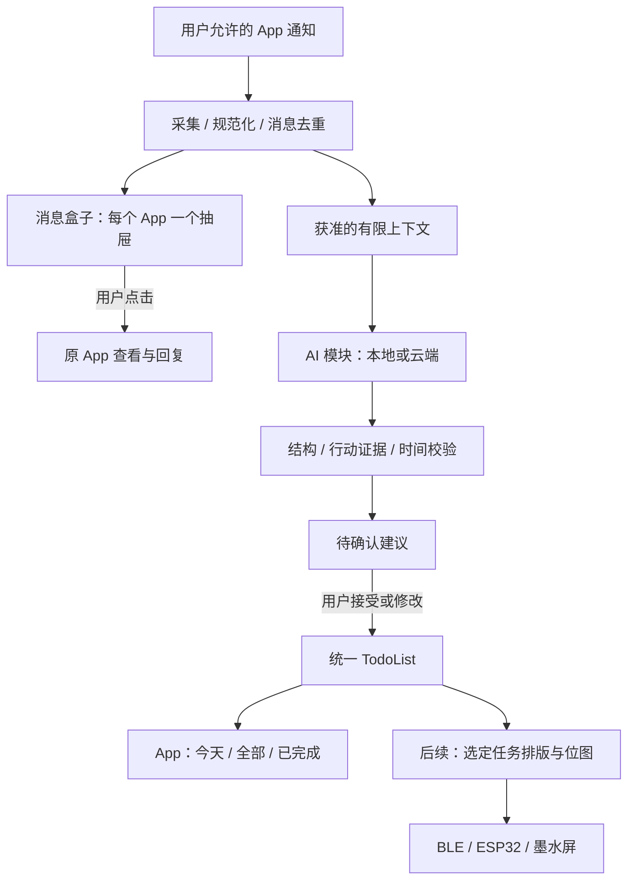

# TodoInk：核心闭环可行性与验证路线

- 日期：2026-09-22；版本：v0.1；状态：产品研判与验证建议，非功能已完成声明。
- 用户核心目标：整合获准 App 的消息，结合 AI 生成 TodoList，先在 App 呈现，后续扩展墨水屏。
- 本文是当前产品方向总览；详细规格继续使用 [消息盒子](TodoInk_消息盒子与发出消息可见性.md)、[AI 模块](AI/README.md)、[Phase 2](../harness/MVP_PHASE2_PLAN.md)。原 [PRD](../reference/TodoInk_PRD_Technical_Design.md) 作为参考快照保留。
- 用户要求的首版建设方案已整理为 [产品 MVP v0.1](../harness/MVP_PRODUCT_PLAN.md)，统一范围、页面、任务顺序与验收；本文保留为可行性依据。

## 1. 判断

**核心链路技术可行，值得先验证手机端价值。最大的待验证项是任务相关信息能否被通知充分覆盖，以及生成的建议是否减少遗漏和整理负担。**

产品定位：从获准且实际可见的消息中，整理有来源的个人行动清单。消息盒子负责集中查看 / 追溯，AI 负责理解，TodoList 负责执行，墨水屏负责后续持续展示。

不把“完整同步所有 App 的双向聊天记录”作为这一版本的成立条件。仅通知权限做不到这个承诺，但仍可从“明天交报价单”等明确请求生成有用候选。无法取得用户回复，会影响“用户是否答应、是否拒绝、是否已完成”的判断，因此这些状态由用户确认，不假装自动推断成功。

## 2. 各环节的可行性

| 环节 | 技术判断 | 首要限制 / 实测问题 |
| --- | --- | --- |
| 通知整合 | 可复用现有 NotificationListenerService / Room | 来源是否产生通知、正文是否可见、ROM 后台行为、重复和更新 |
| App 抽屉 | 常规本地分组与展示，可实现 | 消息与通知版本区别、App / 用户资料隔离、计数口径 |
| 点击跳转 | 有效 contentIntent 可交给来源 App 处理 | 是否直达会话由来源定义；历史入口可能失效 |
| AI 行动项提取 | 两种引擎共用结构化提取与校验，工程路径成立 | 中文执行对象、否定 / 条件句、时间、上下文、误报和漏报 |
| TodoList 管理 | Kotlin / Room / Compose 可承载 | 重复任务、迟到 AI 覆盖用户编辑、任务变更与来源关联 |
| 墨水屏 | Android → BLE → ESP32 → 屏幕的路线成立 | 选定屏幕适配、重连、完整帧校验、刷新完成与功耗 |
| 自动获知已回复 / 已完成 | 通知路线不能可靠保证 | 缺少发出消息及业务回执；不能用打开 App 或通知消失替代 |

Android 的监听 API 面向通知，不是聊天数据库访问；来源不发布或系统不提供的内容无法由该 API 补齐。Android 15 还限制非受信监听器读取含 OTP 的未脱敏通知。因此应描述真实覆盖范围，不宣传收齐所有聊天。[监听 API](https://developer.android.com/reference/android/service/notification/NotificationListenerService)、[Android 15 通知保护](https://developer.android.com/about/versions/15/behavior-changes-all#otp-redaction)

## 3. 产品主链与职责

消息盒子按 App 分抽屉，TodoList 按用户行动统一组织，避免用户做事时还要逐个 App 找任务。一条任务保留来源入口和必要证据；原通知过期后正式任务保留，并说明来源已清理。

现阶段不开发 TodoInk 内直接回复，不等待“抓到所有发出消息”才推进 AI 提取，也不把跳转原 App 视为任务完成。需要用户提供上下文时可后续增加主动分享 / 补充入口，明确这是用户提供的信息。

## 4. AI 应该如何把消息变成任务

处理顺序建议为：先判断是否存在与用户相关的行动，再提取动作 / 对象 / 截止信息 / 证据，最后检查去重与已存在任务关系。建议标题应可执行，例如“发送报价单”，而非把整条聊天或摘要直接塞进清单。

| 示例消息 | 合理处理 |
| --- | --- |
| “请明天 15 点前把报价单发我” | 生成行动和截止建议，引用原文，确认后入清单 |
| “我明天把报价单发给你” | 对方承诺，不直接变成用户的发送任务；等待事项以后另设计 |
| “大家有空看看” | 对象 / 时间不明，降低优先级或保留需判断，不给每人强造任务 |
| “如果客户确认了再发合同” | 条件行动，不能变成无条件立即发送；首版提示人工判断 |
| “时间改到周五了” | 仅在可追溯到相关事项时建议变更；关联不确定时不自动覆盖 |
| 原 App 里回复了“已发”，但 TodoInk 未看到 | 保持原任务状态，不能臆测完成 |

首版沿用“AI 自动生成待确认项，用户确认后进入正式 TodoList”。这已经自动化了发现、整理和填写；确认用于解决责任归属、时间歧义和误报。待积累真实效果后，可另设计明确场景的自动正式入库策略，不把模型自报置信度当正确率。

工程重点：

- 同通知重复上报、同消息被多个快照引用，不重复推理 / 建任务；提取版本升级不复活已忽略项。
- 对短句使用有限的同会话上下文，只有可信会话标识且来源授权成立时补充；不把同 App 所有消息混成一段上下文。
- 跨 App 相似任务初期只提示可能重复；“标题相似”不足以自动合并同一客户、合同或项目。任务合并后仍需保留所有有效来源关系。
- 变化、取消、否定和条件需覆盖样本。首版不自动完成 / 删除用户任务，AI 结果不得覆盖用户编辑。
- 明确时间用固定消息锚和时区复核；“下班前”等不能擅自变成 18:00。数据不足时允许无日期或待确认。
- 推理失败、未获准处理和非任务分开；不可用时保留消息，不把失败显示成“没有要做的事”。

这些是应用层设计建议，实际质量必须用生产引擎与独立样本测出；不能从模型能输出 JSON 推出任务判断准确。

## 5. 本地 / 云端 AI 在主链的位置

两种方式继续作为已选产品方向，统一输入、输出和候选服务。首个技术试验可用先就绪的真实引擎跑通，最终双模式交付仍需两条路线各自通过，不把另一条仅留接口算完成。

本地模式验证中文提取质量、延迟、内存、温度和后台恢复；云端模式验证协议兼容、来源授权、用量、限流与断网。来源过滤、消息去重和合并短时间重复处理可减少无效调用；不承诺未经测量的成本或续航。供应商 / 模型与运行时依据见 [AI 可行性评估](TodoInk_AI消息处理可行性评估.md)。

消息默认本地保存；选择云端时仅发送明确获准的必要内容，本地失败不自动改云端。通知内的指令属于待分析数据，AI 不因此获得发送消息、改权限或执行任务的工具。

## 6. 墨水屏是同一任务数据的第二种展示

推荐手机继续保存正式任务并负责筛选、排序、排版和生成位图；ESP32 接收并校验帧、驱动屏幕，不在设备上再运行消息理解模型或维护第二份任务规则。首版墨水屏仅显示用户选定的已确认任务，编辑与完成仍在手机上。

Android 提供 BLE 中央角色及 GATT 通信 API，ESP-IDF 提供 BLE 协议栈和示例，因此这条软硬件传输路线有标准实现基础。[Android BLE](https://developer.android.com/develop/connectivity/bluetooth/ble/ble-overview)、[ESP-IDF Bluetooth](https://docs.espressif.com/projects/esp-idf/en/stable/esp32/api-reference/bluetooth/index.html)

墨水屏刷新模式、残影处理、刷新间隔和待机策略须按具体屏幕规格决定。合并任务变更后刷新，避免把每条通知都变成一次屏幕刷新；先不承诺刷新速度或电池天数。[Waveshare 官方屏幕使用说明](https://www.waveshare.com/wiki/E-Paper_Shield)

现有 [DeviceTransport](../../app/src/main/java/com/todoink/app/device/DeviceTransport.kt) 已预留整帧发送和 DISPLAYED 确认。后续需明确帧 ID、内容版本、分包、长度 / 校验、重传和显示完成：数据收到不等于屏幕已显示。断线时保留最后成功画面，展示最后同步时间；屏幕只是某个版本的展示副本，不能误称实时。

如显示内容敏感，需补设备身份 / 传输保护和展示范围。未来若支持设备按键完成任务，再单独设计双向事件和版本冲突；不在初版为此复制任务数据库。

## 7. 如何验证它确实有用

先用合成样本做业务回归，再做用户选定来源的脱敏真实试用。需要同时记录以下指标，不能只报告模型输出成功率：

| 维度 | 要回答的问题 | 记录口径 |
| --- | --- | --- |
| 输入覆盖 | 真正需要记住的事项，有多少进入了可见通知？ | 人工确认的应办事项、是否发通知、是否可读、是否采集成功，分别计数 |
| 提取质量 | 看得到的行动项中，AI 找出多少、误认多少？ | 固定样本的候选准确率 / 召回率、不确定比例、时间字段错误及分子分母 |
| 实际整理负担 | 用户是否比手工抄录更省事？ | 接受 / 修改 / 忽略比例、审核耗时、重复任务数、漏掉的重要事项 |
| 可靠性 | 第二天再开还能信任清单吗？ | 重放幂等、重启恢复、来源撤销、过期清理、旧结果不能覆盖用户操作 |
| 运行代价 | 能否在目标手机持续使用？ | 本地资源 / 电量 / 延迟，云端请求 / 用量 / 错误，明确设备与版本 |
| 墨水屏体验 | 展示是否正确、及时且可读？ | 任务版本、最后刷新、断连恢复、中文可读性、刷新与耗电实测 |

特别区分“没收到”与“收到但没提取”。即使模型在已见文本上很好，若重要事项主要发生在不会发通知的场景，整体价值仍会受限。这时应增加用户主动导入或选定平台的正规数据接入，而不是继续调提示词假装补齐来源。

## 8. 推荐推进顺序

| 阶段 | 最小交付 | 进入下一步的依据 |
| --- | --- | --- |
| A：可用消息盒子 | 补齐 NI 的正文 / 去重 / 可靠性，按 App 抽屉查看并跳转 | 选定来源的通知可见性与缺失原因有真实记录 |
| B：手机端任务闭环 | 稳定消息 → AI 候选 → 编辑确认 / 忽略 → TodoList → 用户完成 | TD / AI 的相关契约与质量、恢复、隐私验收通过 |
| C：实际使用优化 | 减少误报 / 重复、评估审核负担，完善双模式 | 用户持续愿意用清单，关键漏项与成本可解释 |
| D：墨水屏扩展 | 手机渲染确认任务 → BLE → ESP32 → 显示确认 | 软件清单稳定后验证硬件展示和功耗 |

这是产品验证顺序，不替换现有任务 ID：A 复用 NI 和消息盒子规格，B 使用 TD-000–TD-008 / AI-001–AI-005，C 对应 Phase 3，D 对应 Phase 4–5。用户已否决的直接回复不再作为任何阶段前置；发出消息采集是增强研究，不能阻塞主链。

## 9. 当前距离目标还有什么

源码已观察到通知采集、来源设置、通知列表 / 详情和四入口 UI。消息正文投影 / 幂等仍有 NI 缺口，待办与待确认是空态，没有实际 AI 引擎；硬件仅有传输接口。文档与页面存在不能当作核心闭环已建立。

本轮结论为：技术路径可行，真实通知覆盖、AI 质量、整理负担和硬件效果尚待实测；没有依据给出全场景准确率、月费或交付日期。验证时继续遵循 [Harness](../harness/README.md)，新增实施范围按用户选定工作推进，本轮只交付探索与文档。

本轮与消息盒子补充一起完成研究文档交付（DONE）；68 个应用 / 构建文件开始 / 结束重新比较，哈希一致、文件集合不变。Static 退出 0，补充 5 份文档的 35 个本地链接和 UTF-8 检查通过，记录在 STATE；未运行模型、操作联系人或连接硬件。检查仅证明文档一致性，实际产品与硬件验收仍为 NOT_RUN。
