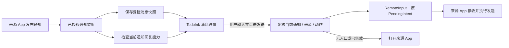

# TodoInk：跨 App 回复可行性评估

- 日期：2026-09-22；版本：v0.1；状态：历史研究，直接回复产品路线已被用户明确否决，不继续实施。当前采用 [消息盒子 → 按 App 分抽屉 → 跳转来源 App 回复](TodoInk_消息盒子与发出消息可见性.md)，下文仅保留历史技术分析。
- 用户目标：采集各 App 消息后，在 TodoInk 内输入并发送回复。
- 依据：Android 官方 API / 平台说明、KDE Connect 官方项目功能说明，以及当前 TodoInk 源码。本文不把资料中的示例当成实施或发送授权。
- 关联：[AI 模块](AI/README.md)、[当前交接](../harness/STATE.md)、[本轮记录](../harness/tasks/REPLY-RESEARCH-feasibility.md)。

## 1. 结论与推荐

**在 Android 上有条件可行。推荐利用来源 App 通知提供的标准直接回复动作，做“支持的消息可在 TodoInk 内回复”，不能承诺“所有 App、所有消息都能回复”。**

“收到通知”“读取到消息正文”“取得可用回复入口”是三项独立能力。通知只包含消息文字时，TodoInk 无法凭文字、昵称或包名生成一个有效发送通道。历史快照仍在数据库里，也不代表当时的回复入口仍然可用。

建议首版让用户手动输入并点击发送；不支持时提供“打开来源 App”。后续 AI 可以生成可编辑草稿，但草稿生成与真实发送独立，仍由用户确认接收对象和最终文本。通知回复不需要等待 AI 双模式完成，可以先做独立的小型验证。

## 2. 标准技术路径

Android 的 Direct Reply 允许来源 App 在通知 Action 中提供 `RemoteInput` 与 `PendingIntent`。前者描述回复输入，后者承载来源 App 授予的特定操作；直接回复自 Android 7.0 起提供系统通知交互。TodoInk 当前 minSdk 29，不存在这一基础 API 的最低版本障碍。[Direct Reply 官方说明](https://developer.android.com/develop/ui/compose/notifications/create-notification#reply-action)

`PendingIntent` 可以交给另一应用执行创建者指定的操作；`RemoteInput.addResultsToIntent()` 用来把收集的回复文本填入发送 Intent。由这些公开 API 可推导出：TodoInk 可在自己的页面收集输入，再调用来源通知已经提供的回复动作，最终由来源 App 处理消息发送。这是可实施路线，具体目标 App 仍须验证。[PendingIntent](https://developer.android.com/reference/android/app/PendingIntent)、[RemoteInput](https://developer.android.com/reference/android/app/RemoteInput)

已有产品佐证：KDE Connect 官方 Android 项目明确提供从桌面读取和回复 Android 通知的功能。这说明第三方通知回复存在实际产品路径，但不构成微信 / 企微 / QQ 在用户手机上的支持证明；本轮未复制其实现代码。[KDE Connect 官方项目](https://github.com/KDE/kdeconnect-android)

这是单次消息处理入口，不是重新实现微信等 App 的协议或登录系统。用户通常无需在 TodoInk 再登录来源账号；发送依赖来源 App 的账号、网络和业务处理。通过该 IPC 路线发送本身不要求 TodoInk 持有来源账号凭据；AI 云端推理的网络与授权另行管理。

## 3. 可行范围与限制

| 情况 | 判断 | 首版行为 |
| --- | --- | --- |
| 活跃通知暴露明确、可自由输入的回复动作 | 有条件可在 TodoInk 内回复 | 显示输入框与来源 / 目标信息，发送前复核 |
| 只提供预设选项的 RemoteInput | 不能当成任意文本输入 | 首版提示不支持自由回复；预设选项以后按需扩展 |
| 没有 RemoteInput，只有点击打开 App | 不具备标准内联回复能力 | 打开来源 App，由用户回复 |
| 多会话摘要、目标不明、多回复动作无法判定 | 有误投风险，不能猜 | 禁用内联发送，打开来源 App |
| 通知移除、替换、来源关闭、监听断开 | 当前能力不可依赖 | 暂停发送；重连后仅重新检查仍活跃的通知 |
| 来源 App 收到请求但离线 / 会话受限 | 可能已受理但未真正发出 | 显示“已提交给来源 App”，不显示已送达 |
| 图片、语音、附件、引用某条消息、@指定成员 | 超出首版纯文本能力 | 回来源 App 完成 |
| 发给从未出现过通知的联系人 | 通知路线没有可用目标入口 | 不提供按昵称搜索后直接发送 |

`Notification.Action` 可声明回复语义、文本输入及解锁要求；仅有按钮名“回复”并不足以识别可靠通道。自定义 ROM 的小窗、快捷面板和通知直接回复也不能混为一谈。[Action API](https://developer.android.com/reference/android/app/Notification.Action)

Android 15 会对非受信通知监听器隐藏检测到 OTP 的通知内容，不能把通知权限理解为可完整读取任何通知。工作资料、企业设备策略也可能限制监听范围；此类通知按实际可见能力处理。[Android 15 说明](https://developer.android.com/about/versions/15/behavior-changes-all#otp-redaction)、[NotificationListenerService](https://developer.android.com/reference/android/service/notification/NotificationListenerService)

当前重点来源的结论：

| App | 已知依据 | 本轮结论 |
| --- | --- | --- |
| 微信 | 尚无本机 / 当前版本 Action 与 RemoteInput 观测 | 待真机验证，不预写“支持”或“不支持” |
| 企业微信 | 同上；需区分个人资料与工作资料、私聊与群聊 | 待真机验证，不把企业服务端接口等同个人会话回复 |
| QQ | 尚无本机 / 当前版本可回复通知观测 | 待真机验证，不能从采集成功推出回复成功 |

能力应按**每条当前通知**实时判断，再汇总 App 覆盖率；不能维护一个“安装了微信就能回复”的固定白名单。后续兼容性报告必须记录 App 版本、Android / ROM、账号资料、私聊 / 群聊与通知形态。

## 4. 为什么不优先选其他路线

| 路线 | 可用价值 | 对 TodoInk 的取舍 |
| --- | --- | --- |
| 通知 RemoteInput | 复用现有通知监听和来源会话入口 | 首选，能力不足时明确退回来源 App |
| 平台官方消息 API | 平台确有接口、账号授权和目标会话标识时，可做专门适配 | 按平台另立适配任务；不存在凭一个通用 URL / Key 代理所有个人聊天的方案 |
| Accessibility 模拟打开会话、输入、点击发送 | 对某些可访问页面可做流程自动化 | 涉及页面 / 语言 / 版本 / 锁屏适配，不能承诺稳定后台回复，不建议作为初版兜底 |
| 私有协议、Hook、Root | 会改变当前运行与维护前提 | 不作为普通 Android App 的建设路径 |

若以后发布 Google Play，无障碍路线还涉及专门的声明、披露和自动化使用政策；普通助手不自动属于无障碍工具。此限制针对该路线，不表示标准通知回复被禁止。[Google Play 官方政策](https://support.google.com/googleplay/android-developer/answer/10964491?hl=en)

本轮尝试访问企微官方接口页面，未能读取完整正文，因此不宣称已验证某个企微服务端 API 能代表个人账号回复任意会话，也不采用搜索摘要中的限制数字作为依据。若目标转向企业客服 / 机器人，应单独核验发送身份、会话范围、授权和回执。

## 5. TodoInk 当前需要补什么

源码已观察：

- [Listener](../../app/src/main/java/com/todoink/app/notification/TodoInkNotificationListenerService.kt) 只有通知发布、连接与断连处理，当前没有移除事件的回复能力失效逻辑。
- [Extractor](../../app/src/main/java/com/todoink/app/notification/SnapshotExtractor.kt) 复制文本和 MessagingStyle 等字段，没有提取回复 Action；[Draft](../../app/src/main/java/com/todoink/app/notification/model/NotificationSnapshotDraft.kt) 不保存 RemoteInput / PendingIntent。
- 来源过滤已在 `NotificationIntake` 提取前执行。C01 / C03 的白名单和受控数据边界继续保留；不能把整个 Notification / Bundle 塞进持久化消息或 AI 输入。
- 当前存在以 `sbn.isGroup` 代替准确 summary 判断的已登记缺口。回复前必须按实际 `FLAG_GROUP_SUMMARY` 等信息区分摘要与普通群聊；普通群聊不是天然不可回复，但不能把群内某个人的昵称当成私聊收件人。

建议仍在单 `:app` 内增加回复业务包，与 AI 模块分离：

| 拟定职责 | 作用 |
| --- | --- |
| ReplyCapabilityResolver | 从当前通知判断可否自由文本回复、目标是否可辨、是否需要解锁；UI 只拿可展示状态 |
| ActiveReplyRegistry / 系统适配层 | 短期保存最小能力句柄，或按 key 即时重取通知；通知更新 / 移除、来源撤销、断连时更新或失效 |
| ReplyCoordinator | 用户发送意图、版本校验、单次提交、重复点击抑制和结果分类 |
| NotificationReplySender | 装填受控 RemoteInput 并调用原 Action；不自己构造来源 App 私有组件 Intent |
| ReplyAttemptRepository | 记录本地尝试 ID、关联来源、时间与提交状态；不把运行时能力写入 Room |
| 回复 UI | 在通知详情显示输入框、目标、能力状态、草稿和发送结果，不新增一个空泛聊天主导航 |

短期能力句柄可封装最小 `PendingIntent` / `RemoteInput`，仅留在系统适配层内存；这是新回复用例的受控边界，不改变持久化 Draft / Parser 的无 Android 对象契约。实施时登记包依赖并验证失效 / 内存释放；不提前修改检查器。

## 6. 避免回错会话与重复发送

以下是拟定工程契约，不代表 Android 保证了业务投递：

1. 回复目标绑定用户资料、来源包、通知 key、当前回复动作和本地能力版本，必要时附可验证的会话依据；昵称、标题、正文相似度、同一 App 的“最后一条通知”都不能作为改投依据。
2. `getActiveNotifications(keys)` 可按 key 重新取得仍活跃的通知，须等待监听连接。打开回复框时展示目标和相关原文，发送前再次检查；若更新导致目标或能力版本不确定，要求用户重新查看后发送。即使通知正文未变，Action 也可能变化，因此能力刷新不能只依赖 Room 的内容去重事件。[监听服务 API](https://developer.android.com/reference/android/service/notification/NotificationListenerService#getActiveNotifications(java.lang.String[]))
3. 优先识别声明回复语义且有自由文本 RemoteInput 的动作；缺少语义时，仅对经验证的唯一适配规则启用。多个输入 / 多个动作不把同一文本盲填到全部字段；只支持固定、明确的回复输入，否则降级。
4. 校验动作创建者与来源 / 资料一致、句柄未失效；无法验证的委托动作先不支持。API 31+ 可检查 immutable 状态，明确不可变则拒绝需要附加输入的路线；低版本依据具体适配与行为测试，不绕过或重新创建他方 PendingIntent。[PendingIntent API](https://developer.android.com/reference/android/app/PendingIntent)
5. 首版只允许用户在 TodoInk 前台、设备已解锁时点击发送，遵守动作认证要求；Activity 型动作归类为打开来源 App，不伪装为留在 TodoInk 的后台回复。目标 API 不支持某些类型查询时使用版本保护和适配验证。[Action 认证要求](https://developer.android.com/reference/android/app/Notification.Action#isAuthenticationRequired())
6. 保存来源撤销与本地发送准入串行化；撤销成功后不接受新发送，已经交给系统的操作不能保证撤回。即使最后一次检查通过，检查与 IPC 间仍可能失效，必须处理异常；不能声称跨进程原子锁定了目标会话。
7. 每次用户点击先持久化尝试 ID 和 DISPATCHING，再调用一次；重复点击共用本次尝试。崩溃在调用前后可能结果未知，重开显示 UNKNOWN，禁止自动重放；本地去重不提供来源 App 的“严格只发送一次”保证。
8. 发送与候选确认分开：回复“收到”不自动完成待办，确认待办也不自动回复；收到自己回复产生的通知不应无限触发回复或重复待办。

`PendingIntent.send()` 返回或 `OnFinished` 回调只能反映动作调用过程，不能当成对方收到消息的业务回执。拟定状态：草稿 → 提交中 → 已提交给来源 App；调用明确失败显示失败，调用后状态丢失显示结果未知。只有未来某个平台提供并验证了业务回执，才能新增对应“已送达”状态。通知消失或出现一条类似回显也不能通用地作为送达证明。[PendingIntent 发送语义](https://developer.android.com/reference/android/app/PendingIntent#send(android.content.Context,int,android.content.Intent,android.app.PendingIntent.OnFinished,android.os.Handler))

## 7. 页面与 AI 的衔接

通知详情新增状态：“可直接回复 / 暂不可回复 / 回复入口已失效”。可用时显示输入框和“发送”，发送前在同一界面清楚显示来源 App、会话 / 群名、当前相关消息；无法可靠展示目标时不启用发送。不支持时显示“打开来源 App”，优先使用仍有效的 contentIntent，失效时只能尝试打开 App，不能承诺直达原会话。跳转由用户前台点击触发，遵守系统 Activity 启动规则。[Activity 启动约束](https://developer.android.com/guide/components/activities/secure-bal)

首版独立设置“允许在 TodoInk 回复”的来源范围，默认关闭且不能超出采集范围。通知读取授权不直接等于允许后台自动回复。用户每次明确点击发送即可，不在正常发送路径反复增加确认弹窗。

用户离开时保留受控草稿；草稿正文和诊断遵循来源保留期与备份边界，不写普通日志。来源 / 目标变化后不能自动携带草稿发送到新会话。回复能力失效不删除用户已输入内容，但明确需要回原 App 处理。

AI 可在后续提供“帮我拟回复”，流程为选取有限获准上下文 → 本地 / 云端生成草稿 → 用户编辑 → 人工发送。复用现有 AI 的模型与隐私策略，但新增独立提示模板、输出校验和授权用途；不能因为已经允许提取待办，就默默把更多会话 / 回复草稿送给云端。AI 不持有 PendingIntent、不选择新的收件人、不调用发送工具。**AI 在本地生成草稿不意味着最终消息不出手机：点击发送后，来源 App 仍需将消息发送给对方。**

## 8. 最小验证顺序与退出条件

| 步骤 | 范围 | 必须取得的证据 |
| --- | --- | --- |
| R-0：只读能力探测 | 一台目标真机，微信 / 企微 / QQ 分别产生受控私聊与群聊通知 | App / ROM 版本、动作数、语义、输入类型、认证要求、摘要 / 单会话标记；不记录私人正文 / token |
| R-1：受控通道验证 | 独立测试来源 App 提供标准回复 Action；模拟有效、无入口、取消、多个输入等 | TodoInk 输入文本准确交给指定测试 Receiver，多会话不串线；平台流程证明不等于三款 App 支持 |
| R-2：真实 App 人工发送 | 用户在选定测试会话中点击发送，接收端人工核对 | 两端对应文本、会话与时间；区分本地提交、来源处理与实际收到，不从日志猜送达 |
| R-3：失效与产品整合 | 通知更新 / 移除 / 重发、锁屏、监听撤销、来源关闭、离线、重复点击与进程重启 | 无误投、无自动重复发送，降级可用、草稿不误投，状态准确；再决定支持范围 |
| R-4：AI 草稿（可选后续） | 在回复通道已验后接 AI | 同一发送边界，人工确认、上下文授权与草稿质量通过 |

三款 App 各至少覆盖：私聊、群聊、多个会话摘要、快速更新、通知移除后回复、锁屏与隐藏预览。额外覆盖双账号 / 工作资料（如实际使用）、来源离线、Action 失效、撤销权限和提交期间重启。没有产生通知、没有标准 Action 和发送失败分开计数，不能把不支持场景从总体覆盖率中隐藏。

当前所有 R-0–R-4 均为 **NOT_RUN**。建议先做 R-0：若核心来源完全不暴露回复入口，就尽早采用“统一查看 + 草稿 + 跳转回复”的产品边界；若覆盖关键使用场景，再实现手动纯文本闭环。评测前不承诺全 App 支持、送达率或工期。

本轮只进行了公开资料检索、源码检查与文档编写；没有读取实际通知内容、调用回复 PendingIntent、向联系人发送消息、调用 AI 或安装探测 APK。实施时沿 [验证矩阵](../harness/VERIFICATION.md) 执行软件与真机检查；任何真实发送实验都需明确的测试对象、文本和用户操作范围。
