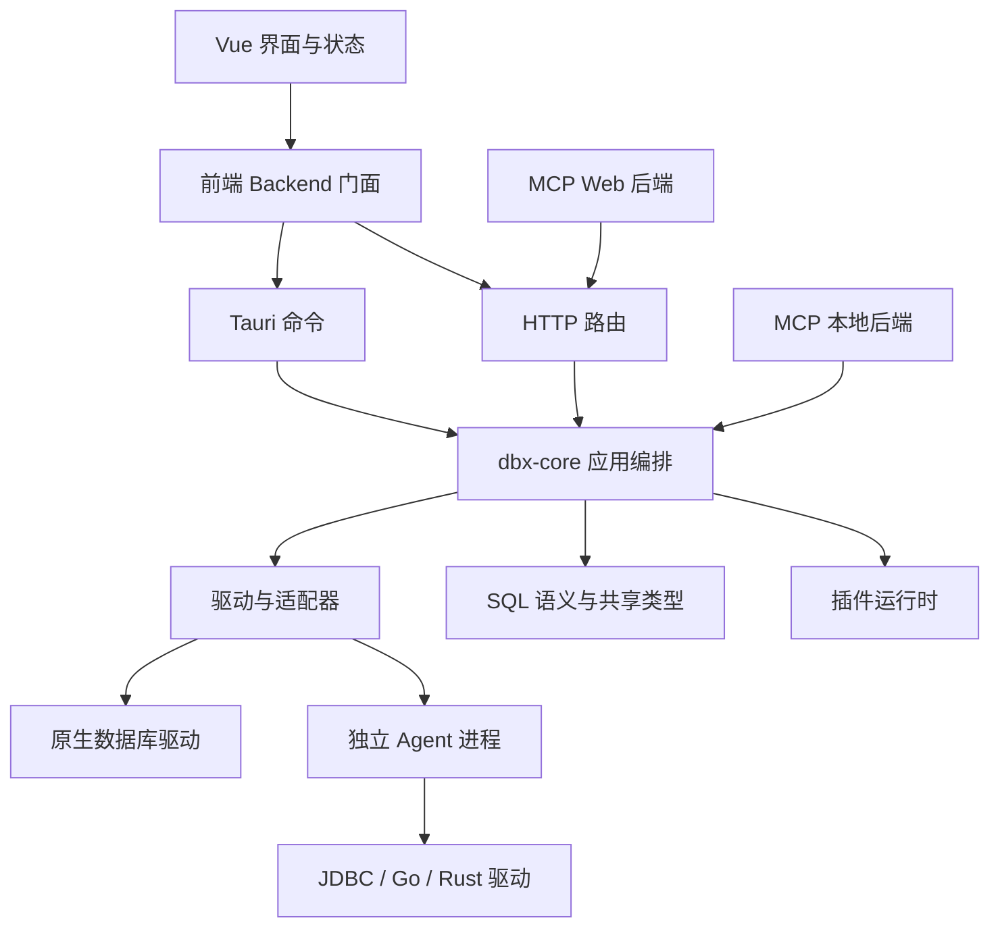

# DBX 项目开发模式扫描与框架提炼建议

> 扫描日期：2026-09-18  
> AI 开发补充更新：2026-09-19，见第 13 节；分析提交保持不变。  
> 仓库：[t8y2/dbx](https://github.com/t8y2/dbx)  
> 分析基线：`main` 的固定快照 [8454560f66a292b50e9be3d9e1621e98584a33c0](https://github.com/t8y2/dbx/commit/8454560f66a292b50e9be3d9e1621e98584a33c0)，提交时间 2026-09-18 18:16:13（北京时间）。  
> 本文区分三类内容：**仓库事实**、**分析判断**、**建议方案**。建议的框架与模板不是 DBX 已发布的通用框架。

## 1. 核心判断

**DBX 最值得我们学习的是：把多端、多数据库、多语言扩展带来的复杂性，收敛为共享核心、显式契约、能力描述和自动检查。**

它的工程价值可以提炼成三层：

1. **团队工程模板：优先建设。** 统一开发命令、模块边界检查、契约生成、行为测试规范、CI 门禁、PR 与交接模板。
2. **共享应用基础库：结合现有技术栈建设。** 应用服务、适配器接口、结构化错误、恢复策略、异步结果防过期、操作权限与上下文。
3. **插件与跨进程扩展平台：按需求建设。** 当确实存在独立发布、第三方扩展、多语言 SDK 或依赖隔离需求时，再引入协议、安装、签名和生命周期治理。

**建议先做一个“能跑通真实业务的工程骨架”，通过两个业务模块验证边界，再沉淀公共库。** 不建议第一步就照搬整个 Rust/Tauri 技术栈、数据库兼容层或插件市场。

对“扎实”的评价有代码依据：可以看到架构依赖检查、类型生成校验、类型化恢复策略和带异常场景的行为测试。但它也有大文件、历史文档漂移、字符串错误兼容路径，以及非阻断 CI 检查，不能把“项目有机制”理解成“所有部分都已完全统一”。[架构检查][S03]、[错误恢复实现][S13]、[CI 工作流][S18]

## 2. 扫描范围与证据强度

首轮通过 GitHub API 获取完整递归文件树，固定提交后定向读取 **53 个文件**，重点核对架构、接口、生成器、测试、CI、插件和发布脚本；另检查基线提交的代码差异及其关联 PR #9497。第 13 节补充读取 9 个文件，累计 62 个。Git 克隆与源码压缩包下载在当前网络下失败，因此本地保留的是选定源码样本，不是完整可构建副本。

| 项目 | 本次观察 | 解读边界 |
| --- | --- | --- |
| 文件树 | 5,477 个 blob 文件条目，递归结果未截断 | 包含文档、资源和 vendor；不等于源码文件数 |
| Rust workspace | 根清单列出 13 个成员 | 不包含所有独立 Agent 工程 |
| 前端测试 | `apps/desktop/src/` 下 1,121 个 `.spec.ts` 文件 | 文件数量不是测试用例数或覆盖率 |
| Rust 外置测试 | `crates/` 下 `tests/` 目录中的 76 个 `.rs` 文件 | 未计入源文件内部测试，不代表全部都在默认 CI 执行 |
| CI | 30 个 GitHub workflow 文件 | 未逐个运行或审计所有工作流 |
| 连接描述 | `plugins/connection-types/` 下 82 个 YAML 文件 | 与 README 的支持数据库数量统计口径不同，不能直接互换 |
| 动态抽样验证 | CI 规划器相关测试实际运行 33 项，全部通过 | 只验证规划、门禁和特性覆盖判断逻辑 |
| 未验证范围 | 完整 Rust/Vue 构建、数据库实连、桌面交互、发布签名、生产性能 | 本文不是全量质量认证或安全审计 |

动态验证环境为 Windows、Node.js v24.14.0。运行命令：

```bash
node --test --test-skip-pattern='git diff routing includes' .github/scripts/ci-plan.test.mjs
```

主动排除了 1 个创建“带换行文件名”的 Git diff 测试，因为该文件名不适用于 Windows。其余 **33 项通过，0 项失败**；Node 报表将名称过滤项排除在测试总数之外。实际运行的是仓库原有测试，未修改其断言。[规划器测试][S20]

未核实 GitHub 分支保护配置，因此下文“门禁”指仓库内已经实现的检查逻辑，不代表已确认每个检查都被设置为合并必需项。

## 3. 架构：一个核心承接多个入口

### 3.1 当前结构

| 位置 | 主要职责 | 可借鉴的边界 |
| --- | --- | --- |
| `apps/desktop/src/` | Vue、TypeScript、状态与交互、前端调用门面 | UI 不直接承担数据库驱动职责 |
| `src-tauri/` | 桌面宿主、Tauri 命令及平台集成 | 入口适配与核心业务分离 |
| `crates/dbx-web/` | HTTP 路由、认证、Web 状态与传输 | HTTP 语义留在 Web 边界 |
| `crates/dbx-mcp/`、`crates/dbx-cli/` | MCP 与命令行入口 | 复用已有能力与策略 |
| `crates/dbx-core/` | connection、query、schema、data、safety、persistence 等应用编排 | 按业务能力划分核心目录 |
| `dbx-types / dbx-sql / dbx-drivers` | 公共模型、SQL 语义、驱动实现 | 模型与规则和基础设施分层 |
| `dbx-platform / dbx-formats / dbx-ai-provider` | 平台能力、导出格式、AI 提供方集成 | 相对独立的技术能力 |
| `dbx-plugin-runtime/`、`plugins/`、`agents/` | 插件运行时、描述文件、独立驱动进程 | 扩展以协议和能力契约接入 |

依据：[workspace 清单][S01]、[核心导出与目录][S02]、[架构约束][S03]。

下图表示抽样确认的主要关系，不是所有模块依赖的完整图：



前端 `api.ts` 根据运行环境动态选择 `tauri` 或 `http` 模块；MCP 的后端实现既有调用核心函数的路径，也有对接 Web 的路径。不能因此推断所有入口功能完全一致。[前端门面][S04]、[MCP 后端][S28]

### 3.2 一条可以核实的业务链路

以“创建消息队列租户”为例：

```text
Tauri mq_create_tenant ─┐
                       ├─ mq_create_tenant_core
HTTP create_tenant ────┘       │
                              ├─ 核心层检查连接是否允许写入
                              ├─ 获取 MQ adapter
                              └─ adapter.create_tenant(...)
```

- 桌面命令调用 `dbx_core::mq::service::mq_create_tenant_core`。
- HTTP 路由处理请求身份/范围与错误映射，再调用同一核心函数。
- 核心函数自己也检查写入限制，随后调用适配器。
- `MessageQueueAdmin` 定义管理操作和能力查询接口，各系统的实现位于 adapters 中。[桌面命令][S05]、[Web 路由][S06]、[MQ 服务][S07]、[MQ 接口][S08]

**提炼原则：入口可以不同，业务不变量要有共同的执行位置。** 入口身份校验、连接读写限制、用户确认分别属于不同边界，不能只靠前端按钮禁用保证正确性。

## 4. 值得提炼的 11 种开发模式

### 4.1 模块边界由自动检查维护

**仓库事实。** `scripts/core-architecture.test.mjs` 读取 Cargo metadata，对部分基础 crate 的内部依赖建立白名单。检查包括开发和构建依赖，避免通过测试依赖绕过边界；也检查生产依赖不能启用 `test-support`，以及生成器、运行资产、Docker/Nix 输入归属。[架构测试][S03]

**解决的问题。** “分层架构”容易随着功能迭代变成目录命名，底层模块逐渐反向依赖上层业务。

**框架提炼。**

- 建立模块依赖图与允许依赖规则。
- CI 对新增依赖、反向依赖、循环依赖和生产测试钩子执行检查。
- 新模块必须登记；未登记时应报错或进入完整检查路径。
- 业务模块用契约通信，禁止直接引用其他模块的内部实现。

**边界。** DBX 的检查对一组基础 crate 进行了显式限制，并非所有模块都已建立完备依赖规则。它还包含源码位置与文本检查；我们应优先检查依赖和公开契约，避免锁定无关目录细节。

### 4.2 共享应用服务，入口保持薄层

**仓库事实。** MQ 管理服务中的 `*_core` 被桌面与 Web 共同调用；核心按 connection、query、schema、data 等业务目录组织。[核心模块][S02]、[MQ 服务][S07]

**解决的问题。** 同一需求在页面、接口、脚本中各写一遍，之后修复只能覆盖某个入口。

**框架提炼。**

- Application Service 负责业务编排、关键校验和操作结果。
- Controller、Command、Job、CLI Adapter 负责输入转换、身份上下文、传输与展示。
- 外部数据库、文件、消息队列等通过 Port 接口接入。
- 同一业务规则应能绕开 UI 单独测试。

**适用场景。** 管理后台 + 定时任务、Web + 移动端、业务接口 + 批量导入，都适合这一模式；无需有桌面端才值得采用。

### 4.3 用声明式描述统一“系统支持什么”

**仓库事实。** `plugins/connection-types/postgres.yaml` 同时描述数据库标识、运行模式、默认端口、traits 和 capabilities。TypeScript 生成脚本读取这组描述并生成类型、配置；Rust `build.rs` 生成枚举和数据库 manifest，并检查版本与重复标识。[Postgres 描述][S09]、[TS 生成器][S10]、[Rust 生成器][S11]

**解决的问题。** 前端有一份枚举，后端有一份注册表，页面再维护一份功能判断，新增对象时容易漏改。

**框架提炼。**

```text
描述文件
  → Schema 与语义校验
  → 后端注册信息 / 前端类型与展示配置
  → 生成结果一致性检查
  → 能力契约测试
```

适合声明的内容：稳定标识、展示名称、字段、枚举、功能开关、版本、默认值、兼容范围。

**边界。**

- 描述应表达差异和能力，不应承载任意业务脚本。
- 静态声明不等于实际运行权限或在线可用性；运行时仍需校验。
- DBX 当前使用不同语言的生成/校验代码，不是所有规则都自动共享；仍需要跨语言一致性测试。
- 生成器的 `--check` 模式应只检查并失败，不应在 CI 中自动修改文件掩盖漂移。

### 4.4 能力接口优于到处判断厂商名称

**仓库事实。** `MessageQueueAdmin` 通过 `capabilities()` 暴露能力；`ExternalTabularSource` 抽象表格型外部数据；数据库能力函数读取统一 manifest。部分不支持的 MQ 操作提供明确错误默认实现。[MQ Port][S08]、[外部数据接口][S29]、[数据库能力][S12]

**解决的问题。** 分散的 `if mysql / if oracle / if 某供应商` 会让每次接入影响大量业务代码。

**框架提炼。**

- 用接口定义“能做哪些动作”，用能力描述定义“当前实现支持哪些动作”。
- 业务依赖接口；厂商差异放到适配器。
- 对不支持的动作明确拒绝，不要返回空结果冒充成功。
- 页面展示、后端校验、契约测试使用一致的能力定义。

**边界。** MQ Port 已有较多专用操作，说明“一个万能接口”也会膨胀。我们可以按查询、写入、元数据、管理等能力拆分接口，避免强迫每个实现提供大量空方法。

### 4.5 结构化错误与恢复策略分开

**仓库事实。** 后端错误对象包含版本、稳定错误码、本地化键、参数、来源与 `operationOutcome`。恢复策略使用类型化失败及操作范围决定保留 Session、隔离 Session、替换 Runtime，或有限重试只读元数据。[错误实现][S14]、[恢复策略][S13]

关键点是：**恢复连接，不等于重放刚才的业务操作。** 对用户 SQL 操作，不会因为连接看起来恢复了就自动重试；只有特定 connection + quarantine 的只读 metadata 场景允许首次重试。超时、取消和传输失败也有不同处理。[错误处理规范][S15]

**框架提炼。**

| 信息 | 回答的问题 | 应由谁消费 |
| --- | --- | --- |
| 稳定错误码 | 发生了什么类型的问题？ | 日志聚合、客户端分支 |
| 用户摘要与本地化键 | 如何向用户解释？ | UI |
| 执行结果状态 | 是否能确定操作没有开始？ | 应用服务、补偿/重试策略 |
| Session/连接处置 | 资源还能否继续复用？ | 基础设施恢复层 |
| 诊断详情 | 如何定位原因？ | 排障工具 |

我们可以在框架中建立 `ErrorEnvelope + ErrorCatalog + RecoveryPolicy`，但不要简单添加一个 `retryable: true` 后自动重放所有请求。实际重试还应检查幂等性、事务状态、次数和结果可确认性。

**边界。** MQ 等抽样接口仍返回 `Result<..., String>`；DBX 并非所有业务都完成结构化迁移。数据库 SQL 错误详情也可能保留业务内容，不能把“有脱敏逻辑”理解成“所有 detail 都可公开分享”。[MQ Port][S08]、[错误规范][S15]

### 4.6 前端异步结果携带“有效代次”

**仓库事实。** `createObjectBrowserRowsLoadGuard` 为请求分配递增 epoch，并复制冻结请求范围。新请求或失效操作递增 epoch；旧请求完成后必须通过 `isCurrent` 才能写回。测试模拟切换连接/数据库后旧统计请求才返回，确认其不会写缓存。[LoadGuard][S16]、[对应测试][S17]

**解决的问题。** 用户切换筛选条件、租户或页面后，旧请求覆盖新状态；组件销毁后仍有异步回调写状态。

**框架提炼。**

```typescript
// 建议伪代码，不是 DBX 原始 API。
const ticket = loadGuard.begin({ tenantId, pageId, filters });

const result = await repository.load(ticket.scope);

if (!loadGuard.isCurrent(ticket)) return;
state.rows = result;
```

可沉淀为小型 `LatestRequestGuard<Scope>`，与取消请求、错误提示、缓存 key 配合使用。

**边界。** epoch 判断只阻止过期结果写回，不会取消后台工作，也不提供权限隔离。DBX 此处 scope 是浅拷贝冻结；若我们的 scope 包含嵌套对象，需要不可变数据或更完整的快照策略。

### 4.7 测试围绕真实行为与契约

**仓库事实。** CONTRIBUTING 明确要求调用生产函数或挂载真实组件、只 Mock 外部边界，并反对用源码字符串锁定局部变量和模板写法；对权限、发布产物、兼容性等契约保留必要的文件检查。[贡献规范][S21]

基线提交 #9497 的修复不是只增加刷新通知：新增组件测试覆盖正确范围刷新、其他连接/数据库/schema/catalog 不刷新，以及延迟刷新前范围变化的竞态。[实际提交][S22]

**可提炼的分层。**

| 测试层 | 验证对象 | 推荐断言 |
| --- | --- | --- |
| 规则单测 | 纯计算、校验、状态转换 | 输入与输出、边界条件 |
| 组件/服务行为测试 | 生产组件和服务 | 可观察状态、结果、事件 |
| 契约测试 | 入口、插件、跨语言协议 | 字段、版本、错误语义、一致行为 |
| 架构测试 | 依赖和能力归属 | 禁止依赖、未登记模块、生成漂移 |
| 实连/产物测试 | 数据库、安装包、平台 | 实际查询、恢复、安装和启动 |

**边界。** #9497 仍修改了一个源码字符串测试，说明规范与历史测试正在共存。另有真实 PostgreSQL 测试带 `#[ignore]`，要求显式数据库环境；“仓库里有 live test”不能推断“每次 CI 都跑了”。[实连测试样本][S23]

### 4.8 CI 按影响范围选择，未知情况扩大检查

**仓库事实。** CI 规划器读取改动文件和 Cargo workspace 元数据，沿反向依赖扩展受影响模块，考虑开发/构建依赖、描述文件与独立 DuckDB Agent。公共配置、未知成员或未知改动范围会选择全 workspace 路径。[规划器][S19]

分组测试还有特性覆盖审计：比较各组启用的 feature 与 workspace 基准，避免拆分后某项能力悄悄消失。最后的 gate 拒绝必需任务失败、取消、缺失或意外跳过。[特性检查][S24]、[汇总门禁][S25]

**框架提炼。**

```text
改动识别 → 依赖影响分析 → 测试计划 → 执行 → 结果汇总
                  │
                  └─ 不确定：扩大检查范围
```

规划器与汇总器本身也要作为生产代码测试，覆盖删除、重命名、新模块、计划缺失、任务跳过、特性遗漏等情况。本次实际运行的 33 项抽样测试验证了其中多项规则。

**边界。**

- 小项目先全量 CI，等耗时成为问题再引入影响分析。
- 不能仅按目录做过滤而忽略共享依赖。
- 自动退回全量与“规划数据无效则门禁失败”是两种不同机制，不能混淆。
- 工作流里部分步骤采用 `continue-on-error`；汇总器看到 job 成功不表示每个内部步骤都通过。[CI 边界说明][S26]、[工作流][S18]

### 4.9 开发命令和反馈方式标准化

**仓库事实。** Makefile 提供开发、Web、后端、检查、测试和数据库环境命令；`pnpm check` 用脚本组织生成一致性、格式、lint、类型和测试检查，记录耗时并汇总失败输出。CI 固定 Node/pnpm，并使用 frozen lockfile。[Makefile][S30]、[检查入口][S31]、[package.json][S32]

**框架提炼。**

建议每个项目至少统一下列语义，具体用 Make、npm script 或现有构建工具实现：

```text
dev       启动本地环境
check     执行快速且无写入副作用的质量检查
test      执行默认行为测试
build     构建可交付产物
verify    执行契约/集成/产物专项验证
release   生成或展示发布计划，显式执行发布
```

同一命令在本地与 CI 使用同一实现，失败信息要定位到检查项和原因。

**边界。** DBX 文档中对 `dev-fast` 的“跳过 DuckDB”描述与当前 Makefile 启用 `duckdb-sidecar` 不完全一致；本地 fast 和 CI fast 的具体 feature 也不同。我们应让帮助文本、实际参数和文档共用定义。

### 4.10 插件扩展包含完整的安装与生命周期

**仓库事实。** DBX 插件有 manifest、Host API 和 sidecar 协议版本。运行时检查引擎兼容、权限声明、入口文件及路径；安装器经过暂存、校验和、签名、兼容检查再安装，记录激活版本和回退目标。生命周期 guard 防止有活动连接/操作时更新，并阻止更新中接入新操作。[插件文档][S33]、[manifest 校验][S34]、[安装器][S35]、[生命周期及并发测试][S36]

独立数据库 Agent 则通过 stdin/stdout 上的 JSON-RPC 接入，可以使用 JDBC、Go 或 Rust 驱动。[Agent 说明][S37]

**框架提炼。**

一个可维护的扩展点至少需要：

- 明确输入、输出、能力与协议版本。
- 初始化、调用、取消、关闭和升级生命周期。
- 不支持能力及旧版本的明确行为。
- 宿主与插件的权限职责。
- 安装失败恢复、激活记录、回退与资源占用管理。

**边界。**

- 普通业务模块先采用进程内接口和注册机制即可。
- 当多语言依赖、崩溃隔离或独立升级确有收益，再使用进程外协议。
- UI iframe 的限制不等于 native sidecar 获得操作系统级安全沙箱。
- 插件文档概括“版本不可变”，实际安装器对未激活或损坏版本存在替换/修复路径；设计规则应覆盖这些例外，而非照抄口号。

### 4.11 发布、交接和维护也作为工程产物

**仓库事实。** 发布脚本区分 app、agents、packages，支持 dry-run 和分发回退；发布工作流包含多平台构建与签名/产物验证。贡献规范强调小范围 PR、验证说明和 UI 截图；仓库还有一份按任务、进展、文件、决策、限制组织的历史交接文档。[发布脚本][S38]、[发布工作流][S39]、[PR 模板][S40]、[历史 handoff][S41]

**框架提炼。**

- 构建成功后，继续检查产物能否安装、启动、兼容目标平台。
- 发布计划包含版本、基线、目标产物、验证结果、回退范围。
- 交接文档包含当前事实与代码基线，避免只记录对话。
- 将关键决策固化为测试；仅靠下一位开发者或 AI 记住不够。

**边界。** 发布脚本的回退明确不等于降级已升级客户端；历史 handoff 引用的一些路径也已改变。一个 handoff 样本只能证明使用过这种协作方式，不能据此认定全部项目遵循统一 AI 开发流程。本次完整文件树未发现 `AGENTS.md` 或 `CLAUDE.md`。

## 5. 对实际开发过程的还原

基于规范、入口脚本、测试与一个实际提交，可以把 DBX 的开发方式概括为下面的过程；这是证据支持的工作模型，不是对所有贡献者操作的逐一确认。


其中最值得复制的顺序是：

1. 先判断变化属于业务规则、描述数据、平台入口还是外部适配器。
2. 先保证共享逻辑正确，再补齐各入口。
3. 用一个真实失败场景建立回归，加入必要的权限、状态切换、取消和异常分支。
4. 用 CI 检查实现是否破坏既有依赖、类型、功能和产物。
5. 将尚未验证的环境写清楚，避免以“有测试代码”代替“已验证”。

[贡献规范][S21]、[实际提交][S22]、[检查脚本][S31]、[CI 规划][S19]

## 6. 我们应该提炼成什么框架

### 6.1 第一层：团队工程模板，优先级 P0

**交付形态：模板仓库 + 检查脚本 + 示例业务 + 开发规范。**

| 内容 | 最小实现 | 验收标准 |
| --- | --- | --- |
| 统一命令 | dev/check/test/build | 新成员可按文档运行，本地和 CI 同源 |
| 模块边界 | 明确允许依赖方向 | 故意加入反向依赖时检查失败 |
| 契约与生成 | 选一类枚举/接口/能力描述作为唯一来源 | 改源定义但不更新产物时 CI 失败 |
| 错误约定 | 错误码、摘要、执行状态、兼容规则 | 两种入口对同一失败返回一致语义 |
| 行为测试基线 | 一个真实服务和一个真实组件测试 | 修改生产行为可以触发失败 |
| PR 模板 | 原问题、结果、验证、风险与截图 | 审阅者无需读聊天记录即可理解改动 |
| 交接模板 | 基线、事实、决策、未完成、下一步 | 下一位开发者能找到实际文件和验证入口 |

这层收益最普遍，适合既有项目渐进接入，不要求改变业务技术栈。

### 6.2 第二层：共享基础库，优先级 P1

**交付形态：一个小型依赖包，或项目内边界清晰的模块。**

建议从以下能力中按真实重复程度选择：

| 候选模块 | 稳定职责 | 留在业务中的内容 |
| --- | --- | --- |
| application-core | 用例执行、输入校验、结果协议 | 业务对象、业务状态转换 |
| contract-kit | 类型/Schema、版本、兼容校验 | 某个业务的字段与规则 |
| error-kit | 错误目录、归一化、展示转换 | 具体错误定义及诊断信息 |
| capability-registry | 能力描述、注册、查找 | 某产品/租户/适配器的能力配置 |
| operation-policy | 操作上下文、权限检查扩展点、幂等/结果状态 | 审批规则、数据权限表达式 |
| async-state | 请求代次、取消协作、状态写回保护 | 页面筛选和交互逻辑 |
| adapter-test-kit | 一套可复用契约测试 | 真实驱动/外部系统行为 |

**抽取门槛建议：** 第二个独立业务确实能复用同一行为、生命周期和测试，再提升为公共能力。两个地方只是长得像，不足以证明它们具有相同语义。

### 6.3 第三层：扩展平台，优先级 P2

仅当存在明确需求时实施：

- 第三方团队独立开发功能。
- 模块需要独立升级。
- 不同语言 SDK 或原生依赖无法合理装入主进程。
- 特定模块故障需要隔离。
- 主产品必须控制基础包体积。

这时再建设 manifest、能力协商、宿主 API、安装器、签名、版本激活和回退。没有这些需求时，普通接口、注册表与模块化打包通常已足够。

## 7. 建议的最小工程骨架

以下是**建议目录**，不是 DBX 原目录，也不要求把每一层拆成独立发布包：

```text
project/
├─ apps/
│  ├─ web/                       # 页面、状态、入口适配
│  └─ api/                       # HTTP / 平台 Action 入口
├─ modules/
│  ├─ application/               # 应用服务与业务编排
│  ├─ contracts/                 # DTO、事件、错误与接口
│  ├─ policies/                  # 权限、操作结果、恢复规则
│  └─ adapters/                  # 数据库、文件、外部 API
├─ descriptors/                  # 有明确生成价值的声明
├─ tooling/
│  ├─ check                      # 唯一检查入口
│  ├─ check-boundaries            # 依赖边界
│  └─ check-generated             # 生成物一致性
├─ tests/
│  ├─ behavior/
│  ├─ contract/
│  ├─ architecture/
│  └─ integration/
├─ docs/
│  ├─ architecture.md
│  ├─ decisions/
│  └─ changes/
└─ .github/workflows/ci.yml
```

### 7.1 最小业务契约示意

```typescript
// 框架建议伪代码；并非 DBX 现有接口。
interface OperationContext {
  actorId: string;
  tenantId: string;
  requestId: string;
  idempotencyKey?: string;
}

interface AppError {
  version: 1;
  code: string;
  messageKey: string;
  params: Record<string, string | number | boolean>;
  outcome: "not_started" | "unknown";
  traceId?: string;
}

interface SubmitOrderPort {
  submit(input: SubmitOrderInput, context: OperationContext):
    Promise<SubmitOrderResult>;
}
```

关键约束：身份和租户上下文来自可信入口，不能直接相信请求正文；业务校验与事务位于应用服务；是否重试由操作语义和结果状态共同决定。`traceId`、租户和幂等键是我们的建议扩展，不能误记为 DBX 全项目现有契约。

### 7.2 如果使用 Java/Vue 或既有业务平台

沿用原技术栈即可：

| DBX 的做法 | 我们可以采用的等价方式 |
| --- | --- |
| Rust crate 依赖限制 | Java 模块/包依赖检查，或 TypeScript import 规则 |
| `*_core` 共享函数 | Application Service，被 Controller、任务、平台 Action 复用 |
| Rust trait + adapter | Java interface / TypeScript interface + adapter |
| YAML → Rust/TS | Schema/IDL → 后端 DTO、前端类型、校验规则 |
| Tauri/HTTP 入口 | Web、移动端、批处理、外部接口入口 |
| epoch guard | Vue composable 或请求状态工具 |
| CI planner | 基于模块依赖图选择检查；小项目先全量 |

已有平台的实体定义、权限、事务和流程能力应继续使用；框架应补齐共用契约和验证约束，避免再复制一套功能相同的平台层。

## 8. 用一个业务模块验证提炼是否成立

建议选择“业务单据提交”这类既有页面、校验、状态变化，又能从批量接口触发的模块。

### 8.1 试点范围

- 页面提交与批量导入调用同一个提交服务。
- 统一输入契约和错误码。
- 使用既有权限与事务机制。
- 为切换组织/单据后的异步查询加入代次保护。
- 建立业务行为、入口契约和依赖边界测试。

### 8.2 必须证明的行为

| 场景 | 预期结果 |
| --- | --- |
| 页面和批量入口提交同一合法数据 | 关键业务结果一致 |
| 缺少必填条件 | 统一错误语义，业务尚未写入 |
| 用户无权操作 | 在后端拒绝，不能绕过页面直调 |
| 重复提交 | 按明确幂等规则处理 |
| 调用超时、结果未知 | 查询结果或提示核对，不直接重复提交 |
| 切换组织后旧请求返回 | 旧结果不污染当前页面 |
| 引入上层到基础层的反向依赖 | CI 失败 |
| 改契约但遗漏生成结果 | CI 失败 |

这些是框架应给第二个业务模块带来的实际帮助。若只能复制目录、注解和工具函数，却无法复用这些行为与验证，就还没有形成可靠框架。

## 9. 哪些做法不宜直接照搬

| 观察 | 不宜直接复制的原因 | 我们的处理建议 |
| --- | --- | --- |
| 13 个 Rust workspace 成员及多语言 Agent | 对小型业务应用可能增加构建与维护成本 | 先模块化单体，按独立生命周期再拆包 |
| 大型前端门面与后端实现文件 | `api.ts` 超千行、MCP backend 超三千行，存在集中维护压力 | 按业务域拆接口，保留稳定门面 |
| 前端 Backend 类型取自 Tauri 实现模块 | 跨端公共契约仍与具体实现有耦合 | 单独定义公共 Backend contract，各实现满足它 |
| 大量源文件内容断言 | 对真正的架构/安全契约有用，对行为证明有限 | 区分契约检查与功能测试，防止二者替代 |
| 部分检查只告警 | docs-export 漂移与 Nix 等检查有非阻断配置 | 明确哪些必须阻断，为临时豁免设责任人与退出条件 |
| 复杂插件生态 | 协议、分发、升级与信任管理都有持续成本 | 有独立扩展需求再做 |
| 历史文档中的旧路径/旧表述 | handoff、错误文档等未全部跟随模块迁移 | 文档带基线，关键路径/命令可自动检查 |
| 大量兼容补丁与 vendor | 数据库与老平台兼容具有特定产品价值 | 每个补丁登记原因、版本、替代方案和退出条件 |
| “有 PR 模板” | 不等于每个 PR 都完整提供证据 | 校验关键字段，同时保留人工审阅 |

依据：[前端门面][S04]、[MCP 后端][S28]、[架构检查][S03]、[CI 工作流][S18]、[Cargo 补丁说明][S01]、[历史交接][S41]。

额外核对到的文档一致性例子：根 LICENSE 为 Apache-2.0，而 Agent 中文 README 尾部仍写 AGPL-3.0。这说明文档也需要维护；本文只记录该差异，不据此给出整个依赖链的授权结论。[根许可证][S42]、[Agent 文档][S37]

在实际抽样 PR #9497 中，验证复选框和前端截图复选框未勾选；这不能证明作者没有验证，但不能把模板的存在当作验证已执行的证据。[PR 样本](https://github.com/t8y2/dbx/pull/9497)

## 10. 落地顺序与验收

以下按交付物安排，不预设团队人数和工期。

| 阶段 | 主要工作 | 退出条件 |
| --- | --- | --- |
| 第一阶段：建立基线 | 统一命令、最小模块图、PR/变更模板 | 新环境能运行；错误依赖能被阻断 |
| 第二阶段：单模块试点 | 共享服务、错误契约、行为测试、必要的生成器 | 页面与第二入口走同一规则，边界场景通过 |
| 第三阶段：第二模块复用 | 识别真正稳定的公共点，保留业务差异 | 第二模块复用核心契约，无须修改大量框架分支 |
| 第四阶段：优化反馈 | 统计 CI 耗时，必要时引入影响分析 | 优化后未漏检；新模块与未知输入有保守处理 |
| 第五阶段：按需扩展 | 插件/sidecar、独立发布、升级治理 | 有明确使用方，并完成兼容与失败恢复测试 |

建议跟踪：

- 新成员从获取代码到首次运行的耗时。
- PR 首个有效反馈及完整检查的耗时。
- 同一规则在多入口重复实现的数量。
- 缺陷是否配有能复现原行为的回归测试。
- 生成文件漂移、接口不一致、错误依赖的阻断记录。
- 第二个模块接入时需要修改的框架代码范围。

目前没有这些指标的 DBX 历史实测数据，不能宣称采用后必然提升多少效率。

## 11. 可以直接放进团队规范的模板

### 11.1 变更设计记录

```markdown
# 变更：<具体业务行为>

- 代码基线：
- 问题与复现：
- 预期结果：
- 非目标：

## 影响范围
- 业务模块及负责人：
- 页面 / 接口 / 批量任务 / 外部系统：
- 数据结构、权限、事务、兼容影响：

## 契约与规则
- 输入与输出：
- 状态变化：
- 失败结果与错误码：
- 是否幂等，超时如何核对：
- 规则的唯一实现位置：

## 验证
- 原问题回归：
- 权限与异常分支：
- 多入口一致性：
- 需要的真实环境：

## 发布
- 迁移步骤：
- 可回退范围与不可逆部分：
- 尚未验证的限制：
```

### 11.2 PR 描述

```markdown
## 问题与结果
触发条件、原行为、改后行为。

## 实现
核心规则放在哪一层；涉及哪些入口或适配器。

## 验证证据
实际执行的命令、结果、关键场景；UI 改动附截图/录屏。

## 影响与限制
兼容性、迁移/回退方式、未执行检查及原因。

## 关联
Issue / 设计记录 / 接口契约。
```

### 11.3 人与 AI 共用的交接记录

```markdown
# 任务交接

- 更新时间：
- 仓库 / 分支 / 提交基线：
- 当前目标：
- 已完成且有证据的事项：
- 尚未完成事项：
- 关键文件与入口：
- 已确认决策及原因：
- 已运行检查与结果：
- 未验证环境及原因：
- 下一步最小可执行动作：
- 什么条件下需要重新评估当前决策：
```

交接时将“已完成”“待完成”“历史背景”分开，实际路径以当前提交为准。不要把旧任务指令长期留作当前全局规则。

### 11.4 最小完成标准

```markdown
- [ ] 新增行为有明确输入、输出、状态与失败语义。
- [ ] 同一业务规则未在多个入口重复实现。
- [ ] 核心权限和业务不变量在后端执行。
- [ ] 关键回归测试调用生产代码并验证可观察结果。
- [ ] 涉及异步状态时验证取消、过期结果或重复操作。
- [ ] 契约、生成物、文档和实际实现一致。
- [ ] 相关检查已运行，未执行项有原因。
- [ ] 发布和回退范围可说明。
```

## 12. 建议决策

**可以提炼，而且优先提炼“可执行的开发约束”和“少量共享契约”。**

首版集中做：

1. 统一开发与检查入口。
2. 应用服务与外部适配器边界。
3. 模块依赖检查。
4. 一类有实际重复维护问题的声明式契约及生成校验。
5. 统一错误语义和谨慎的恢复策略。
6. 行为测试、PR 证据和基线明确的交接模板。

随后用第二个业务模块证明复用价值，再决定是否独立发布基础库、引入复杂 CI 影响分析或插件平台。DBX 提供的最有价值的参考，是让这些边界能被代码和测试持续验证。

---

## 13. AI 辅助开发：可以进一步提炼的工作框架

> 补充日期：2026-09-19；继续使用相同代码快照，新增读取 9 个文件，累计定向读取 62 个文件。本节讨论 AI 辅助编码、验证和开发维护。

**最值得提炼的是一套让 AI 能够持续接手任务、遵守工程边界、交付可核对结果的开发流程。** 提示词只是入口，长期有效的部分是任务契约、版本化上下文、自动校验和验证证据。

### 13.1 先分清证据：哪些是 DBX 实际做法

| 观察对象 | 可以确认的事实 | 不能据此推断的内容 |
| --- | --- | --- |
| `handoff.md` | 有从 OpenCode 导出的历史交接，记录任务、文件、决策、进展与环境限制 | 全部开发都由 AI 完成，或已实行统一多 Agent 流程 |
| CONTRIBUTING、架构测试、CI | 有明确的改动范围、行为测试要求和自动约束 | 每个贡献者都执行完全相同的步骤 |
| AI Issue 分级脚本及 workflow | 有根据 Issue 文本生成建议优先级并校验输出的自动化实现 | 已读取源码、复现问题或核实真实影响 |
| i18n autofill 脚本及 workflow | 有 AI 补齐新翻译、校验并生成提交的流程 | 翻译语义、术语和语气已由人工全部验收 |
| `skills/dbx/SKILL.md` | 有面向 AI 的数据库工具使用说明，包含发现、查询和上下文获取步骤 | 它是开发 DBX 源码的规则文件 |

`agents/` 主要是数据库驱动进程工程，不能看到这个目录就认定它是“多 AI 开发代理架构”。当前快照没有发现 `AGENTS.md`、`CLAUDE.md`；下面提出的通用 AI 开发框架属于我们的归纳与建议。[交接样本][S41]、[贡献规范][S21]、[AI 分级][AI01]、[i18n workflow][AI04]、[DBX Skill][AI07]

### 13.2 模式一：用任务契约控制 AI 改动范围

DBX 的贡献规范要求一个 PR 聚焦一类变化；历史 handoff 把目标、禁止触碰的范围和架构决策写了出来。这对 AI 开发尤其有价值：让 AI 清楚哪些行为需要改变，哪些是已有约束。[贡献规范][S21]、[历史决策][S41]

我们可以把每次任务输入固定为六项：

1. **目标行为**：什么条件下，当前发生什么，期望发生什么。
2. **范围**：涉及哪个模块、哪些入口，以及明确不涉及的内容。
3. **基线**：分支、提交及已有未提交改动。
4. **不变量**：权限、事务、兼容、数据归属等不能破坏的条件。
5. **验收**：可执行用例或可观察的用户结果。
6. **完成输出**：代码差异、验证记录、限制与交接。

边界要以业务行为为主，文件清单提供导航。若调查发现必须跨出原范围，应解释原因并更新任务记录；过度锁定文件也可能迫使 AI 在错误层打补丁。

### 13.3 模式二：把上下文放进版本化文件

`handoff.md` 的价值在于记录“为什么这样改”“还有什么没证实”，使后续接手者不必重新推导整个任务。它的局限也很明显：路径已迁移，部分“已完成”记录与“当前阻塞”描述存在历史残留。[交接文件][S41]

可提炼成三层上下文：

| 层级 | 内容 | 更新时机 |
| --- | --- | --- |
| 项目长期上下文 | 架构边界、关键命令、契约来源、业务术语 | 规则变化时 |
| 当前任务上下文 | 目标、范围、相关文件、当前假设 | 调查或范围变化时 |
| 验证与交接上下文 | 当前提交、实际验证、未完成、下一步 | 阶段结束或换人/换会话时 |

每条重要结论区分“已观察”“推断”“待验证”。恢复任务时先核对基线与路径，不直接执行旧 handoff 里的下一步。

对于数据相关开发，仓库 Skill 描述了按目标表获取紧凑 schema 上下文的方式，可借鉴其按需获取上下文的思路；本次没有验证这些 CLI 命令的当前运行行为。[数据库上下文说明][AI07]

### 13.4 模式三：把高频规则交给程序检查

AI 容易在局部修复时新增一套枚举、绕过公共入口，或让底层模块依赖上层实现。DBX 使用依赖白名单、描述文件生成和 CI 校验约束这些变化。[架构检查][S03]、[类型生成器][S10]、[CI 规划器][S19]

对我们的框架，规则应有对应的检查：

| 对 AI 的开发要求 | 可执行检查 |
| --- | --- |
| 不新增错误的模块依赖 | import / 模块依赖检查 |
| 不手工维护第二套公共类型 | 生成文件一致性检查 |
| 不破坏其他入口 | 跨入口契约测试 |
| 不因为拆测试而漏掉功能 | 受影响模块与特性覆盖检查 |
| 不把测试钩子带到生产 | 构建依赖及 feature 检查 |

规范负责解释原因，检查负责发现违例。不要只在提示词里反复强调“遵守架构”，却不给 AI 清晰的边界和反馈。

### 13.5 模式四：以生产行为验证 AI 的修改

DBX 的规范明确反对复制实现来写测试，也反对用源码字符串证明普通业务行为；实际修复样本包含真实组件与状态切换测试。[测试要求][S21]、[修复样本][S22]

建议采用以下验证要求：

- 修复缺陷时，尽量建立能在修复前暴露问题、修复后通过的用例。
- 测试调用生产函数或组件，Mock 外部边界。
- 除成功路径外，根据风险检查权限、取消、迟到响应、重复操作和部分失败。
- 审查验收条件是否仍然成立，防止 AI 为了通过检查修改断言或扩大例外。
- 编译通过、单测通过、实连通过、浏览器验证通过分别记录。

“优先建立失败回归”是我们的建议；没有证据证明 DBX 全项目采用了严格 TDD。

复杂任务可以分成实现和审查两个阶段，让审查阶段从需求、差异和验证证据重新判断。是否采用不同的人、会话或 Agent 由任务决定；不能把“第二个 AI 说没问题”当成独立证据。

### 13.6 模式五：AI 输出先经过结构与证据校验

AI Issue 分级是一个直接可参考的实现。脚本：

- 限制模型输入，只提供整理后的标题、正文和相关标签。
- 要求输出 JSON，包含优先级、置信度、风险、理由、原文证据和缺失信息。
- 校验字段类型、枚举、长度，以及引用是否确实出现在输入中。
- 低置信度、没有证据或不满足关键条件时转为 `needs-info`。
- 写回前重新读取 Issue；如果正文、标签范围或状态已变化，就不应用旧结果。
- 仅维护自己的 `ai-priority/` 标签，保留用户和维护者的优先级。
- 新标签添加成功后才删除旧 AI 分类。[分级实现][AI01]、[设计说明][AI02]

这可以提炼为通用流程：

```text
输入快照与范围
  → AI 生成候选结果
  → 结构校验
  → 证据/领域规则校验
  → 核对输入是否仍有效
  → 按权限应用结果
  → 记录结果与未决信息
```

适合复用到需求分类、测试建议、变更说明、代码审查发现和文档草稿。不同任务需要自己的领域校验：源码路径存在不等于缺陷成立，原文引用存在不等于模型推理正确。

本次实际运行该脚本的 **19 项原有测试，全部通过**。测试使用模拟模型响应和 GitHub 客户端，未调用付费模型、未写入仓库。它证明的是脚本校验与失败处理行为，不是模型分类准确率或抗提示注入能力已获完整验证。[测试源码][AI03]

### 13.7 模式六：让 AI 先承担有明确边界的重复工作

i18n 自动补全流程具有清楚的输入和输出：

1. 比较基线与当前中文文案，识别新增 key。
2. 对目标语言补齐缺失翻译。
3. 检查需要的翻译值存在，并验证占位符集合一致。
4. 由程序构造局部修改并重新解析文件。
5. workflow 提交翻译补丁；无法推送时提供补丁信息。[翻译脚本][AI05]、[workflow][AI04]

其工作流还从可信基线复制脚本，再读取 PR 分支的翻译数据；体现了“执行规则”和“待处理材料”分离的思路。本次未对该工作流开展完整安全审计。

我们可以按验证成本安排落地：

| 任务 | 自动化起点 | 仍需核对 |
| --- | --- | --- |
| 翻译、格式与术语一致性 | 生成候选文案并检查 key/占位符 | 语义、领域术语、UI 长度 |
| 变更摘要与文档草稿 | 基于实际 diff 生成 | 是否夸大效果、漏掉限制 |
| Issue 分类 | 建议标签、证据、缺失信息 | 真实复现和业务优先级 |
| 回归用例建议 | 提供候选场景 | 是否调用真实行为、断言是否正确 |
| 业务实现 | 在边界明确的模块内修改 | 权限、事务、状态和兼容性 |

结构校验不能替代语义验收。例如 i18n 脚本校验占位符，不会因此证明翻译含义正确。本次未执行真实模型翻译或推送流程。

### 13.8 模式七：Skill 与工具契约帮助 AI 使用真实系统

DBX 的 Skill 包含能力发现、连接列表、结构探索、上下文获取、查询及错误处理步骤。可以借鉴这种“先发现，再读取，再操作”的设计，使 AI 不必猜测系统对象和调用方式。[Skill 源码][AI07]

对我们的开发工具，可设计：

- 稳定、可机器读取的输入输出。
- 查询能力与写入能力分离。
- 操作范围、分页、结果上限和超时。
- 可定位的错误码和诊断入口。
- 面向当前任务的上下文导出。
- 在执行端落实权限和业务限制。

Skill 适合提供使用步骤和导航；真正的权限与业务约束仍由工具执行端实现。本次没有调用仓库 Skill 操作数据库，也没有将其安装到当前环境。

### 13.9 建议沉淀的最小 AI 开发框架

先交付五项即可：

| 交付物 | 作用 | 最小验收 |
| --- | --- | --- |
| 项目规则入口 | 告诉 AI 去哪里读架构、如何运行检查 | 新任务能找到唯一事实来源 |
| 任务记录模板 | 固定目标、范围、不变量、验收 | 不靠聊天也能理解任务 |
| 检查入口 | 给 AI 稳定的机器反馈 | 错误依赖或契约漂移能失败 |
| 审查与验证模板 | 区分代码完成和验证完成 | 每项结论关联命令或行为证据 |
| 交接记录 | 支持跨人、跨会话持续推进 | 接手者能核对当前状态并继续 |

建议在逻辑上采用以下阶段，不要求创建多个 Agent：

```text
定位问题 → 核对契约 → 实现 → 验证 → 审查差异 → 交接
```

每一步都输出可复用的产物，减少下一步重复读取和重新推断。若以后开发自动执行器，再增加阶段状态、超时、取消、重试边界和执行记录。

任务提示模板可以写成：

```markdown
请完成以下变更：

目标行为：
当前复现：
代码基线：
涉及模块：
必须保留的业务不变量：
验收场景：

开始时核对当前实现、相关契约与测试。
沿既有业务入口实现，必要的范围变化说明原因。
验证生产行为，并记录实际执行的命令和结果。
结束时输出：改动、验证证据、未验证范围、后续动作。
```

### 13.10 如何判断 AI 开发框架是否有效

评价应围绕交付质量和接手成本：

- 一次任务结束后，其他开发者能否复现验证结果。
- 修复是否减少相同问题，而没有破坏相邻正常行为。
- 新会话恢复到有效工作的耗时。
- 审查发现的业务缺陷、无关改动和虚假完成声明。
- AI 自动化被接受、修正或撤回的比例。
- 每项被接受结果的调用成本、耗时与人工复核成本。

仓库的模拟测试可以验证自动化程序边界；若要比较模型或提示词，需另建真实标注样本评测。本次没有模型效果数据，不能从脚本存在或测试通过推算 AI 开发效率。

**建议优先落地“任务契约＋版本化上下文＋自动检查＋证据化验收”，随后接入翻译、分类等范围明确的自动化。** 这既能帮助 AI，也能改善人与人之间的协作。


## 14. DBX 的 Agent Loop：一个受约束的工具调用状态机

前面的 AI 章节讨论的是“如何让 AI 参与开发”；这一节讨论 DBX 产品内部的 AI Agent 是如何运行的。结论是：DBX 确实有独立的 agent loop，而且它不是简单的“不断调用模型直到结束”，而是把模型、工具、数据库权限、上下文压缩、取消和前端事件组织成了一个受约束的状态机。[AL01][AL02][AL03]

### 14.1 代码分层

DBX 把 Agent 拆成四层：

| 层 | 主要位置 | 责任 |
| --- | --- | --- |
| 入口与会话层 | `src-tauri/src/commands/ai.rs`、`crates/dbx-web/src/routes/ai.rs` | 接收请求、校验连接和确认目标、创建取消句柄；桌面通过 Tauri 事件发送，Web 通过 SSE 发送 |
| Loop 编排层 | `crates/dbx-core/src/ai/agent_loop.rs` | 维护多轮对话、调用模型、执行工具、重试、压缩上下文、收敛退出 |
| 工具与权限层 | `crates/dbx-core/src/ai/agent_tools.rs` | 定义工具、限制参数、连接锁、SQL 风险判断、读写权限和实际执行 |
| Provider 与事件协议层 | `crates/dbx-ai-provider/src/ai.rs`、`agent_events.rs` | 统一不同模型供应商的流式响应、工具调用格式、取消注册和事件序列化 |

这使 Tauri 和 Web 入口保持薄：两者都把自己的传输机制接到同一个 `run_agent_loop`，而不是各自复制一套 Agent 逻辑。[AL04][AL05]

### 14.2 一次运行的完整路径

~~~mermaid
flowchart TD
    A[用户请求] --> B[入口校验连接/数据库/确认目标]
    B --> C[创建 AgentLoopContext 与取消句柄]
    C --> D{Provider 类型}
    D -->|CLI| E[委托专用 CLI Agent runner]
    D -->|函数调用 API| F[选择工具集并进入多轮 loop]
    D -->|不支持工具| G[注入 Schema 的 text-only fallback]
    F --> H[TurnStart + 必要时压缩上下文]
    H --> I[流式调用模型]
    I --> J{是否有工具调用}
    J -->|是| K[写操作安全门]
    K -->|阻断/需确认| L[发送语义事件并结束]
    K -->|允许| M[并行只读工具 + 顺序执行工具]
    M --> N[ToolCallEnd，工具结果作为中间证据回填]
    N --> H
    J -->|否| O[校验任务契约]
    O -->|不满足且仍可修复| P[追加 repair prompt，回到下一轮]
    O -->|满足或达到修复上限| Q[AgentEnd]
    E --> Q
    G --> Q
~~~

一次 `run_agent_loop` 的关键顺序如下：

1. 将 `AiTaskContract` 转成系统提示词。SQL 生成、查询、探索 Schema、执行并解释等动作各有不同的完成要求；工具返回值被声明为中间证据，不能直接冒充最终回答。
2. CLI Provider 直接交给对应的 CLI runner，并传入连接、数据库、Schema、写权限和 MCP 命令；非 CLI Provider 才进入内部函数调用 loop。
3. 根据 Agent/Ask 模式选择 `all_tools` 或 `read_only_tools`。如果模型明确不支持 function calling，则补充真实 Schema，走一次 text-only completion。
4. 每轮先检查取消，再按预算决定是否压缩上下文，发送 `TurnStart`，随后流式接收文本、推理片段和工具调用。
5. 有工具调用时，先做写 SQL 安全判断，再根据工具的 `parallel_ok` 元数据拆分并行组和顺序组，执行完后按原始调用顺序合并结果。
6. 工具结果以 `[TOOL RESULT - INTERMEDIATE EVIDENCE]` 形式追加回对话，模型据此继续下一轮；没有工具调用时，才进入最终答案契约校验。
7. 结束时保留部分输出，并用 `AgentEnd` 区分完成、取消、错误和达到最大轮数的情况。

### 14.3 Loop 的状态不是“文本”，而是可恢复的对话记录

每轮会把助手消息写回内部 `conversation_messages`，其中既有自然语言，也有统一化的 `ToolCallRef`。工具调用包含：

- `id`、工具名和 JSON 参数；
- `provider_payload`，保留特定 Provider 后续重放所需的不透明数据，例如 Gemini 的 thought signature；
- 对应的 `ToolResult`，包含内容、错误标记和可选的结构化 `explain_data`。

因此 Provider 适配层可以把 OpenAI、Anthropic、Gemini 等不同协议归一化为同一种 loop 输入，而不会把供应商字段散落到业务工具代码里。[AL03][AL06]

### 14.4 工具执行采用“声明能力 + 运行策略”

`ToolDefinition` 至少包含 `name`、参数 Schema、`read_only` 和 `parallel_ok`。这两个布尔属性实际参与运行时决策：

- `read_only` 参与 Ask 模式的工具白名单和写操作约束；
- `parallel_ok` 决定同一轮是否可以并行。列表、Schema 浏览等只读工具可通过 `join_all` 并发；`execute_query` 等有顺序或权限语义的调用逐个执行；
- 即使并行执行，结果也会按模型原始 tool-call 顺序归位，避免对话记录与调用顺序错位；
- 具体工具仍通过 DBX 的核心连接、Schema 和驱动能力执行，而不是在 Agent 层另造一套数据库访问。

这是一种可提炼的设计：工具定义不仅告诉模型“能调用什么”，还告诉运行时“能否并行、是否只读、应该经过什么策略”。

### 14.5 写操作安全门在工具执行之前

DBX 没有让模型先调用数据库、失败后再询问用户。每轮收到工具调用后，loop 会先扫描 `execute_query` 中的 SQL：

- 非 Mongo 数据库先通过 `write_requires_confirmation` 判断是否是写入或 DDL；
- 未确认的 SQL 不会下发到数据库，而是发送 `WriteSqlConfirmationRequired`，并返回精确的 SQL 提案；
- 如果目标被判定为生产库，则发送 `ProductionWriteBlocked`，不进入确认执行；
- 确认权限绑定到精确 SQL、连接、数据库和 Schema；执行时还会再次消费并核验这一授权，授权不等于“本次会话永久允许写入”；
- Mongo 的 `execute_query` 是受限 shell 读取工具，写入由工具自身拒绝，避免把 Mongo 命令误套成 SQL 风险判断。

这个顺序是 Agent 框架中最值得保留的安全边界：模型可以提出动作，但“提出”和“执行”之间必须有一个可审计、可复核的策略层。[AL02][AL01]

### 14.6 取消是贯穿全链路的控制信号

入口为每个会话注册 `Notify`，取消时只触发对应 session 的通知，完成后注销。loop 在以下位置都检查取消：

- 开始下一轮之前；
- 模型流式请求期间；
- 模型返回、准备执行工具之前；
- 上下文压缩的摘要请求期间；
- text-only fallback 的非流式请求期间。

Provider 流式函数必须返回统一的 `AGENT_CANCELLED_ERROR`，loop 才能把“用户取消”与普通错误区分开。这样 Stop 按钮不会只停止 UI 动画，却让后台继续执行长查询。[AL06]

### 14.7 上下文管理分成两种压缩

DBX 对上下文做了两个层次的控制：

1. **工具结果压缩**：超过 12,000 字符时，只压缩给模型的对话副本；JSON 数组保留头尾样本，普通文本保留头尾并标出中间省略。前端的 `ToolCallEnd` 仍保留完整结果，因此显示和模型上下文可以使用不同的数据粒度。
2. **对话上下文压缩**：接近模型窗口时保留最初用户问题，选择较旧消息生成摘要，并通过 `adjust_cut_for_tool_pair_integrity` 避免把助手的 tool call 与对应 tool result 拆开。摘要请求明确把附带对话标记为不可信数据；摘要失败或格式不合格时，使用确定性的 fallback summary。压缩后发出 `ContextCompacted` 事件。

这比简单截断消息更稳健，因为它同时保护了用户原始意图、工具调用配对关系和 UI 可观察性。[AL01]

### 14.8 任务契约让 loop 有“完成条件”

`AiTaskContract` 不是装饰性的提示词，而是 loop 的收敛条件。典型规则包括：

- `generate`、`optimize`、`fix`、`convert`、`sampledata` 必须产生 fenced SQL；
- `query` 必须真正调用 `execute_query` 获取数据；
- `exploreschema` 必须调用 `list_tables` 或 `get_columns`；
- `executeandexplain` 必须同时执行查询和解释。

当模型没有工具调用却不满足契约时，loop 会自动追加 repair prompt，最多修复两次；达到上限后仍返回已有回答，并追加契约失败说明。这样“模型说完了”不再等同于“任务完成了”。[AL01]

### 14.9 事件协议把后台状态变成前端可观察状态

`AgentEvent` 至少覆盖：

- `TurnStart`、`TurnEnd`：轮次边界；
- `TextDelta`、`ReasoningDelta`：文本和推理流；
- `ToolCallStart`、`ToolCallEnd`：工具调用生命周期；
- `WriteSqlConfirmationRequired`、`ProductionWriteBlocked`：安全策略结果；
- `ContextCompacted`：上下文治理动作；
- `ResponseComplete`：流已读完但不代表 Agent 成功结束；
- `AgentEnd`、`Error`：真正的终态。

`ResponseComplete` 被明确设计为非终态，前端不能据此停止监听 `AgentEnd` 或 `Error`。这类事件语义值得作为通用 Agent UI 协议保留：把“流结束”“本轮结束”“任务结束”“任务失败”分开。[AL03]

### 14.10 可以提炼成我们的通用 AgentLoop 框架

DBX 的实现可以抽象成下面几个稳定接口：

~~~rust
trait ModelAdapter {
    stream_turn(&self, request, tools, cancel) -> TurnResult;
}

trait ToolExecutor {
    execute(&self, call, context, permissions) -> ToolResult;
}

trait ExecutionPolicy {
    authorize(&self, call, context) -> Allow | Confirm | Block;
    parallel_group(&self, tool) -> Parallel | Sequential;
}

trait ContextManager {
    compact_messages(&self, messages, budget, cancel) -> CompactResult;
    compact_tool_result(&self, result) -> String;
}

trait EventSink {
    emit(&self, event: AgentEvent);
}
~~~

在此之上，通用 loop 只负责状态转移：

~~~text
while turns < max_turns:
    check_cancel()
    maybe_compact_context()
    emit(TurnStart)
    turn = model.stream(messages, tools)
    append_assistant(turn)

    if turn.has_tool_calls:
        policy_result = authorize_all(turn.tool_calls)
        if policy_result is Confirm or Block:
            emit(policy_event)
            break
        results = execute_parallel_then_sequential(turn.tool_calls)
        append_intermediate_evidence(results)
        continue

    if contract.is_satisfied(turn.text):
        break
    if repair_attempts < limit:
        append_repair_prompt()
        continue
    append_contract_failure_note()
    break

emit(AgentEnd)
~~~

建议我们的框架把以下字段作为一级概念，而不是藏在工具实现里：`read_only`、`parallel_ok`、风险等级、幂等性、超时、取消行为、结果压缩器、审计信息和是否需要人工确认。这样新增一个工具只需声明能力与策略，loop 不必针对每个工具写分支。

### 14.11 DBX 实现的边界和我们不宜过度抽象的部分

- 当前 loop 仍依赖 DBX 的连接状态、Schema、SQL 分类器和驱动能力；它是数据库 Agent，不是脱离领域的工作流引擎。
- `String` 错误仍较多，复杂系统可以进一步引入结构化错误码和可恢复性分类。
- 任务契约校验目前以规则和字符串扫描为主，适合 SQL 交付类动作；复杂业务应改成结构化输出 Schema 和领域验证器。
- 上下文摘要仍依赖模型，确定性 fallback 只保证可继续运行，不保证摘要质量。
- 最大轮数是防止无限循环的安全阀，不等于按工具成本、数据库耗时或预算进行的完整配额系统。

因此，最值得提炼的不是复制 DBX 的全部数据库工具，而是它的控制面：**模型适配、工具声明、策略授权、上下文治理、取消、事件和完成契约共同组成一个可测试的 AgentLoop 内核**。

### 14.12 建议的落地顺序

1. **P0：** 先实现统一 `AgentEvent`、取消令牌、最大轮数、工具元数据和 `AgentEnd` 终态。
2. **P1：** 加入工具执行策略：只读并行、状态操作顺序执行、精确授权、生产环境阻断。
3. **P1：** 加入任务契约和 repair loop，把“完成”从模型自由文本变成可验证条件。
4. **P2：** 加入上下文预算、工具结果采样、对话摘要和 Provider 级 prompt cache。
5. **P2：** 最后接入 Tauri、Web、CLI 等多种入口，让入口只负责传输和权限边界。

## 附录：关键源码证据索引

以下链接全部固定到本次分析提交；PR 链接用于过程样本。路径与行号可直接在 GitHub 核对。

| 证据 | 文件 / 内容 |
| --- | --- |
| S01–S03 | [workspace 清单][S01]、[core 模块导出][S02]、[可执行架构约束][S03] |
| S04–S08 | [前端门面][S04]、[桌面 MQ 命令][S05]、[Web MQ 路由][S06]、[共享 MQ 服务][S07]、[MQ Port][S08] |
| S09–S12 | [连接描述][S09]、[TS 生成器][S10]、[Rust 生成器][S11]、[数据库能力][S12] |
| S13–S15 | [恢复策略][S13]、[后端错误][S14]、[错误契约规范][S15] |
| S16–S17 | [请求代次工具][S16]、[请求代次测试][S17] |
| S18–S20 | [CI 工作流][S18]、[CI 规划器][S19]、[规划器测试][S20] |
| S21–S23 | [贡献规范][S21]、[基线修复提交][S22]、[实连测试样本][S23] |
| S24–S26 | [特性覆盖检查][S24]、[汇总门禁][S25]、[CI 边界说明][S26] |
| S28–S32 | [MCP 后端][S28]、[外部数据接口][S29]、[Makefile][S30]、[检查入口][S31]、[根 package][S32] |
| S33–S37 | [插件设计][S33]、[manifest 实现][S34]、[安装器][S35]、[生命周期][S36]、[Agent 说明][S37] |
| S38–S42 | [发布脚本][S38]、[发布工作流][S39]、[PR 模板][S40]、[历史 handoff][S41]、[根 LICENSE][S42] |
| AI01–AI03 | [AI 分级实现][AI01]、[自动化边界说明][AI02]、[分级行为测试][AI03] |
| AI04–AI06 | [i18n workflow][AI04]、[翻译脚本][AI05]、[Issue 分级 workflow][AI06] |
| AI07–AI08 | [数据库工具 Skill][AI07]、[完整贡献指南][AI08] |
| AL01–AL02 | [Agent loop 编排][AL01]、[工具与 SQL 权限][AL02] |
| AL03–AL04 | [Agent 事件协议][AL03]、[Tauri Agent 入口][AL04] |
| AL05–AL06 | [Web Agent 入口][AL05]、[Provider 流式与取消注册][AL06] |

[S01]: https://github.com/t8y2/dbx/blob/8454560f66a292b50e9be3d9e1621e98584a33c0/Cargo.toml
[S02]: https://github.com/t8y2/dbx/blob/8454560f66a292b50e9be3d9e1621e98584a33c0/crates/dbx-core/src/lib.rs
[S03]: https://github.com/t8y2/dbx/blob/8454560f66a292b50e9be3d9e1621e98584a33c0/scripts/core-architecture.test.mjs#L10-L70
[S04]: https://github.com/t8y2/dbx/blob/8454560f66a292b50e9be3d9e1621e98584a33c0/apps/desktop/src/lib/backend/api.ts#L1-L55
[S05]: https://github.com/t8y2/dbx/blob/8454560f66a292b50e9be3d9e1621e98584a33c0/src-tauri/src/commands/mq_cmd.rs#L22-L50
[S06]: https://github.com/t8y2/dbx/blob/8454560f66a292b50e9be3d9e1621e98584a33c0/crates/dbx-web/src/routes/mq.rs#L470-L503
[S07]: https://github.com/t8y2/dbx/blob/8454560f66a292b50e9be3d9e1621e98584a33c0/crates/dbx-core/src/admin/mq/service.rs
[S08]: https://github.com/t8y2/dbx/blob/8454560f66a292b50e9be3d9e1621e98584a33c0/crates/dbx-core/src/admin/mq/port.rs
[S09]: https://github.com/t8y2/dbx/blob/8454560f66a292b50e9be3d9e1621e98584a33c0/plugins/connection-types/postgres.yaml
[S10]: https://github.com/t8y2/dbx/blob/8454560f66a292b50e9be3d9e1621e98584a33c0/scripts/sync-connection-types.mjs
[S11]: https://github.com/t8y2/dbx/blob/8454560f66a292b50e9be3d9e1621e98584a33c0/crates/dbx-types/build.rs
[S12]: https://github.com/t8y2/dbx/blob/8454560f66a292b50e9be3d9e1621e98584a33c0/crates/dbx-drivers/src/database_capabilities.rs
[S13]: https://github.com/t8y2/dbx/blob/8454560f66a292b50e9be3d9e1621e98584a33c0/crates/dbx-drivers/src/agent_recovery.rs
[S14]: https://github.com/t8y2/dbx/blob/8454560f66a292b50e9be3d9e1621e98584a33c0/crates/dbx-drivers/src/backend_error.rs
[S15]: https://github.com/t8y2/dbx/blob/8454560f66a292b50e9be3d9e1621e98584a33c0/docs/backend-error-handling.md
[S16]: https://github.com/t8y2/dbx/blob/8454560f66a292b50e9be3d9e1621e98584a33c0/apps/desktop/src/lib/table/objectBrowserRowsLoadGuard.ts
[S17]: https://github.com/t8y2/dbx/blob/8454560f66a292b50e9be3d9e1621e98584a33c0/apps/desktop/src/lib/__tests__/table/objectBrowserRowsLoadGuard.spec.ts
[S18]: https://github.com/t8y2/dbx/blob/8454560f66a292b50e9be3d9e1621e98584a33c0/.github/workflows/ci.yml
[S19]: https://github.com/t8y2/dbx/blob/8454560f66a292b50e9be3d9e1621e98584a33c0/.github/scripts/ci-plan.mjs
[S20]: https://github.com/t8y2/dbx/blob/8454560f66a292b50e9be3d9e1621e98584a33c0/.github/scripts/ci-plan.test.mjs
[S21]: https://github.com/t8y2/dbx/blob/8454560f66a292b50e9be3d9e1621e98584a33c0/CONTRIBUTING.zh-CN.md
[S22]: https://github.com/t8y2/dbx/commit/8454560f66a292b50e9be3d9e1621e98584a33c0
[S23]: https://github.com/t8y2/dbx/blob/8454560f66a292b50e9be3d9e1621e98584a33c0/crates/dbx-core/tests/live_postgres_transaction_recovery.rs
[S24]: https://github.com/t8y2/dbx/blob/8454560f66a292b50e9be3d9e1621e98584a33c0/.github/scripts/ci-rust-coverage.mjs
[S25]: https://github.com/t8y2/dbx/blob/8454560f66a292b50e9be3d9e1621e98584a33c0/.github/scripts/ci-gate.mjs
[S26]: https://github.com/t8y2/dbx/blob/8454560f66a292b50e9be3d9e1621e98584a33c0/.github/scripts/ci-guide.md
[S28]: https://github.com/t8y2/dbx/blob/8454560f66a292b50e9be3d9e1621e98584a33c0/crates/dbx-mcp/src/backend.rs
[S29]: https://github.com/t8y2/dbx/blob/8454560f66a292b50e9be3d9e1621e98584a33c0/crates/dbx-core/src/host/external/traits.rs
[S30]: https://github.com/t8y2/dbx/blob/8454560f66a292b50e9be3d9e1621e98584a33c0/Makefile
[S31]: https://github.com/t8y2/dbx/blob/8454560f66a292b50e9be3d9e1621e98584a33c0/scripts/run-check.mjs
[S32]: https://github.com/t8y2/dbx/blob/8454560f66a292b50e9be3d9e1621e98584a33c0/package.json
[S33]: https://github.com/t8y2/dbx/blob/8454560f66a292b50e9be3d9e1621e98584a33c0/plugins/README.md
[S34]: https://github.com/t8y2/dbx/blob/8454560f66a292b50e9be3d9e1621e98584a33c0/crates/dbx-plugin-runtime/src/plugins/manifest.rs#L766-L908
[S35]: https://github.com/t8y2/dbx/blob/8454560f66a292b50e9be3d9e1621e98584a33c0/crates/dbx-plugin-runtime/src/plugins/installer.rs#L346-L450
[S36]: https://github.com/t8y2/dbx/blob/8454560f66a292b50e9be3d9e1621e98584a33c0/crates/dbx-plugin-runtime/src/plugins/lifecycle.rs
[S37]: https://github.com/t8y2/dbx/blob/8454560f66a292b50e9be3d9e1621e98584a33c0/agents/README.zh-CN.md
[S38]: https://github.com/t8y2/dbx/blob/8454560f66a292b50e9be3d9e1621e98584a33c0/scripts/release.mjs
[S39]: https://github.com/t8y2/dbx/blob/8454560f66a292b50e9be3d9e1621e98584a33c0/.github/workflows/release.yml
[S40]: https://github.com/t8y2/dbx/blob/8454560f66a292b50e9be3d9e1621e98584a33c0/.github/pull_request_template.md
[S41]: https://github.com/t8y2/dbx/blob/8454560f66a292b50e9be3d9e1621e98584a33c0/handoff.md
[S42]: https://github.com/t8y2/dbx/blob/8454560f66a292b50e9be3d9e1621e98584a33c0/LICENSE

[AI01]: https://github.com/t8y2/dbx/blob/8454560f66a292b50e9be3d9e1621e98584a33c0/.github/scripts/ai-issue-priority.mjs
[AI02]: https://github.com/t8y2/dbx/blob/8454560f66a292b50e9be3d9e1621e98584a33c0/.github/scripts/README.md
[AI03]: https://github.com/t8y2/dbx/blob/8454560f66a292b50e9be3d9e1621e98584a33c0/.github/scripts/ai-issue-priority.test.mjs
[AI04]: https://github.com/t8y2/dbx/blob/8454560f66a292b50e9be3d9e1621e98584a33c0/.github/workflows/i18n-autofill.yml
[AI05]: https://github.com/t8y2/dbx/blob/8454560f66a292b50e9be3d9e1621e98584a33c0/.github/scripts/i18n-autofill.mjs
[AI06]: https://github.com/t8y2/dbx/blob/8454560f66a292b50e9be3d9e1621e98584a33c0/.github/workflows/issue-database-label.yml
[AI07]: https://github.com/t8y2/dbx/blob/8454560f66a292b50e9be3d9e1621e98584a33c0/skills/dbx/SKILL.md
[AI08]: https://github.com/t8y2/dbx/blob/8454560f66a292b50e9be3d9e1621e98584a33c0/docs/content/docs/contributing.cn.mdx

[AL01]: https://github.com/t8y2/dbx/blob/8454560f66a292b50e9be3d9e1621e98584a33c0/crates/dbx-core/src/ai/agent_loop.rs
[AL02]: https://github.com/t8y2/dbx/blob/8454560f66a292b50e9be3d9e1621e98584a33c0/crates/dbx-core/src/ai/agent_tools.rs
[AL03]: https://github.com/t8y2/dbx/blob/8454560f66a292b50e9be3d9e1621e98584a33c0/crates/dbx-ai-provider/src/agent_events.rs#L1-L110
[AL04]: https://github.com/t8y2/dbx/blob/8454560f66a292b50e9be3d9e1621e98584a33c0/src-tauri/src/commands/ai.rs#L315-L421
[AL05]: https://github.com/t8y2/dbx/blob/8454560f66a292b50e9be3d9e1621e98584a33c0/crates/dbx-web/src/routes/ai.rs#L342-L511
[AL06]: https://github.com/t8y2/dbx/blob/8454560f66a292b50e9be3d9e1621e98584a33c0/crates/dbx-ai-provider/src/ai.rs#L48-L73
